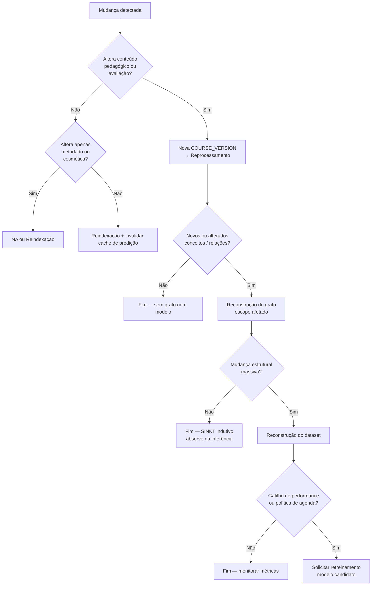
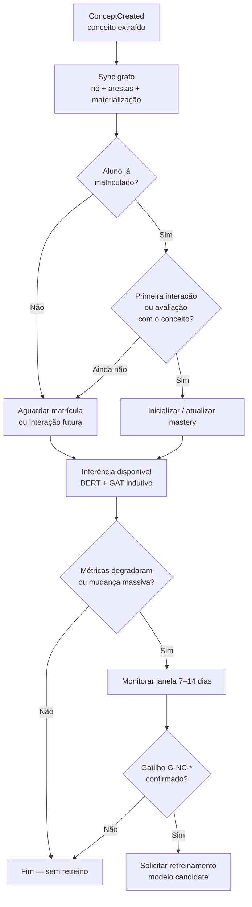
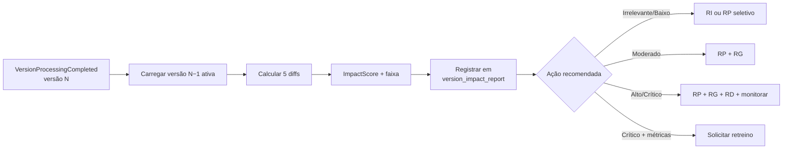
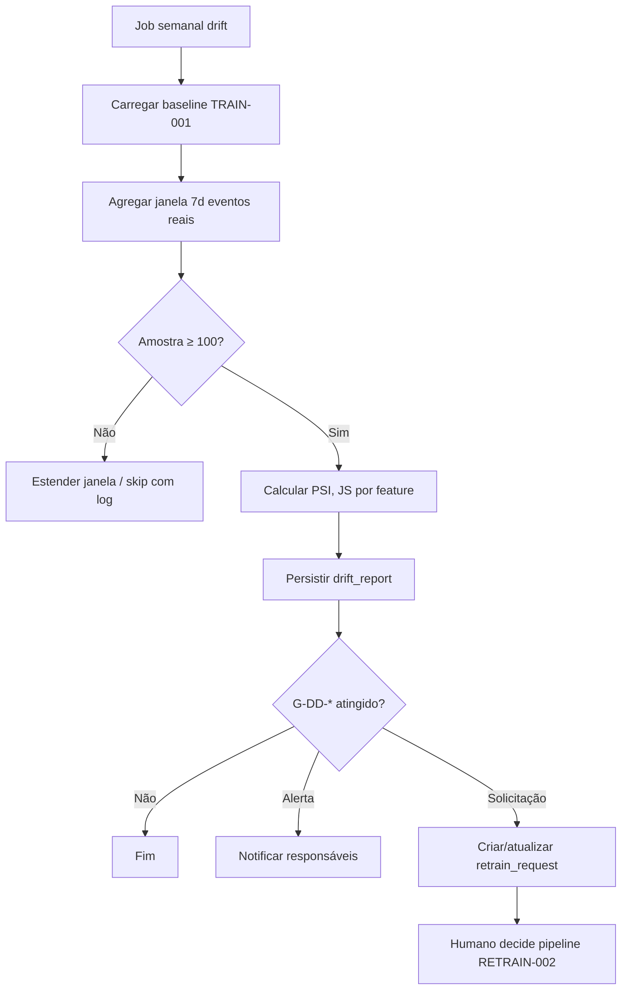
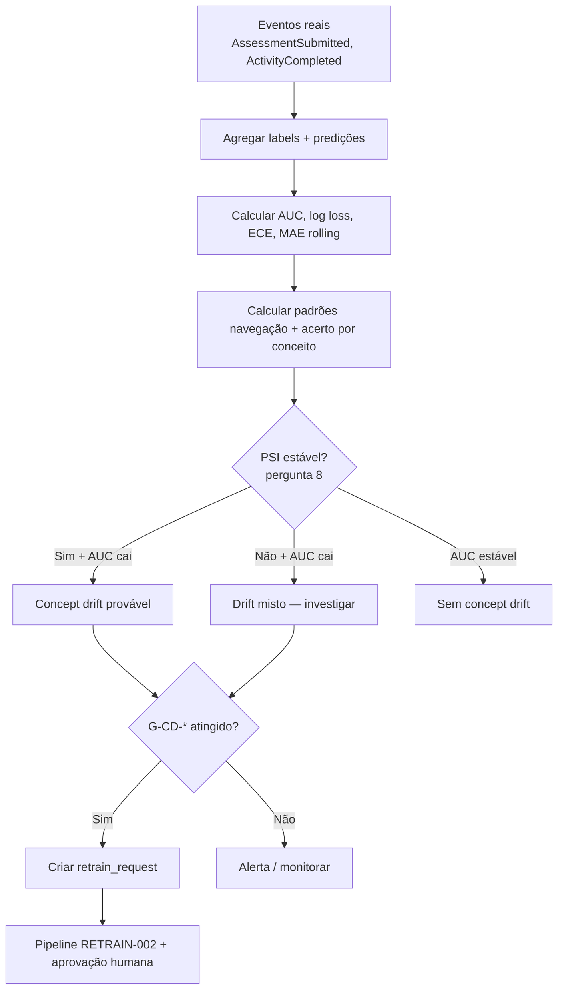
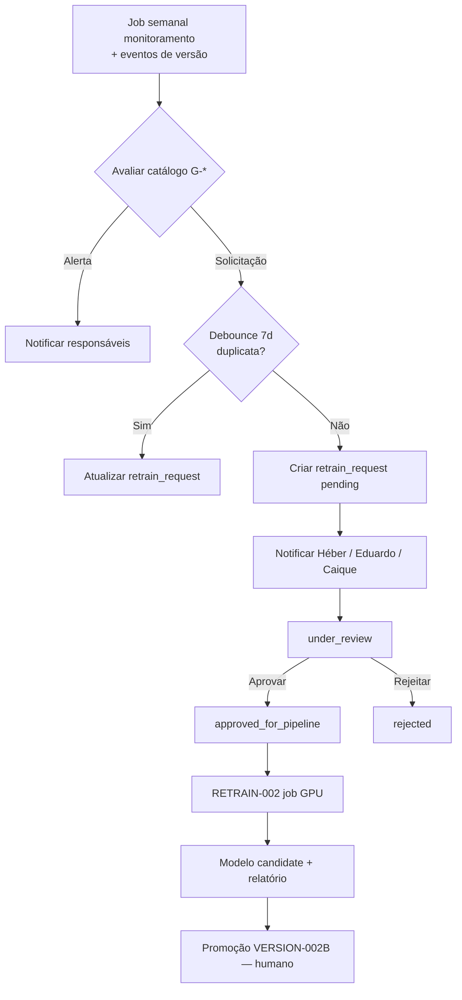
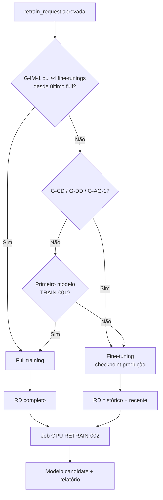
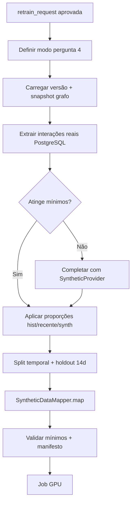
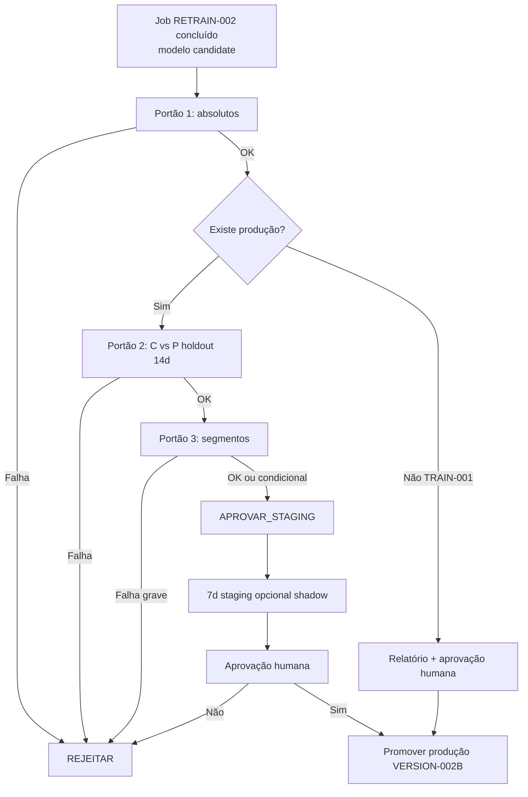
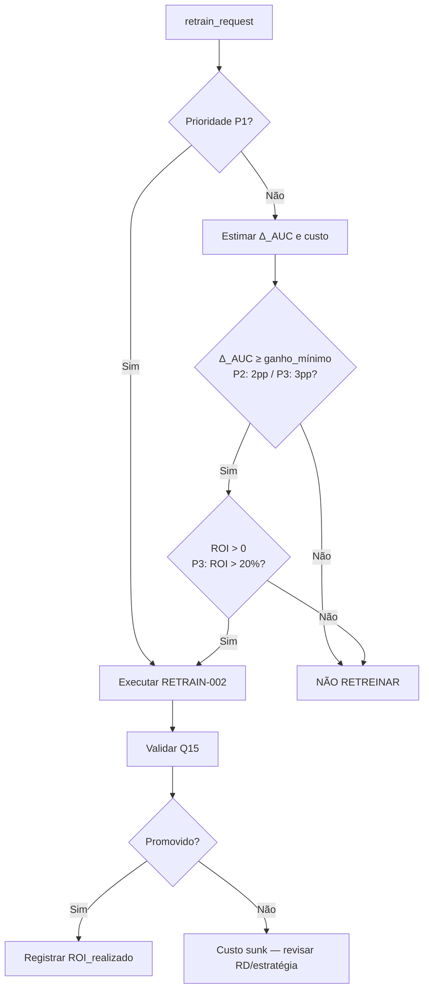

# ANALYSIS-RETRAIN-001 — Respostas (Héber)

Respostas às perguntas obrigatórias da tarefa **ANALYSIS-RETRAIN-001**, conforme divisão em `ANALYSIS-RETRAIN-001_plano-trabalho.md`.

| Campo | Valor |
|-------|-------|
| Responsável | Héber |
| Escopo | ML, treino, métricas, gatilhos de performance |
| Status geral | Em andamento |

---

## Pergunta 1 — Quais mudanças exigem apenas reprocessamento?

### 1.1 Decisão recomendada

Adotar uma taxonomia de **seis níveis de ação**, aplicada **por escopo** (item de conteúdo, módulo, curso inteiro), e não como reação binária “retreina / não retreina”.

A regra central do SINKT:

> **Mudanças de conteúdo e estrutura pedagógica** atualizam pipeline de extração, grafo e (quando necessário) dataset.  
> **Mudanças no estado do aluno** atualizam mastery (Bayesiano, contínuo).  
> **Retreinamento do modelo** é ação de exceção — reservada para degradação de performance, drift relevante ou mudança estrutural massiva — não para cada nova versão de curso.

Isso está alinhado ao backlog (“mastery é atualização operacional; treinamento e retreinamento são atualização do modelo”) e à natureza **indutiva** do SINKT: novos conceitos e questões são codificados via `TextualEncoder` (BERT) e `StructuralEncoder` (GAT) sem exigir novos pesos neurais na maioria dos casos.

### 1.2 Definição das ações

| Nível | Ação | O que acontece no Jedi-SINKT | Quando usar |
|-------|------|------------------------------|-------------|
| 0 | **Nenhuma ação** | Nenhum pipeline ML ou de dados é disparado | Mudança cosmética ou de metadado que não altera conteúdo pedagógico nem artefatos derivados |
| 1 | **Reindexação** | Atualização de índices derivados (busca, cache de embeddings persistidos, projeções de leitura) sem reextrair conceitos nem alterar grafo | Texto semanticamente equivalente; metadados de exibição; invalidação de cache de predição |
| 2 | **Reprocessamento** | Pipeline de extração: `CourseVersionCreated` → chunking (`content`) → extração de conceitos (`concepts`) para o escopo afetado | Conteúdo novo ou alterado que exige nova `COURSE_VERSION` e reextração |
| 3 | **Reconstrução do grafo** | Sync no Apache AGE: nós/arestas, inferência de pré-requisitos (LLM), validação DAG, materialização (`concept_paths`, `concept_prerequisites`) | Conceitos novos/alterados, relações conceito-questão ou conceito-conceito modificadas |
| 4 | **Reconstrução do dataset** | Regenerar dataset de treino versionado (interações + estrutura do curso + snapshot do grafo + split temporal) | Volume relevante de novas interações ou mudança estrutural que altera exemplos de treino |
| 5 | **Retreinamento** | Job GPU (`SinktTrainer`): atualização de pesos do SINKT (fine-tuning ou full training) | Degradação de métricas, drift, ou mudança estrutural massiva que o modo indutivo não absorve |

**Nota arquitetural:** no sistema atual, alterações de conteúdo pedagógico geram **nova versão imutável** (`COURSE_VERSION`). O nível 2 (reprocessamento) é o fluxo padrão dessa nova versão — não é opcional quando há mudança real de material. A pergunta 1 define **o que mais** (grafo, dataset, modelo) precisa acontecer além desse fluxo base.

### 1.3 Princípios de classificação

1. **Presunção de menor ação:** escolher o nível mais baixo que mantém consistência pedagógica e técnica.
2. **Escopo mínimo:** preferir reprocessamento parcial (conteúdo/aula afetada) a reprocessar o curso inteiro quando a plataforma suportar reprocessamento seletivo (história `QUEUE-001B` / reprocessamento seletivo do backlog).
3. **Separação mastery ≠ modelo:** inclusão de aluno, resposta a questão, conclusão de atividade → apenas mastery; nunca dispara retreinamento.
4. **Indutividade SINKT:** inclusão de questão/conceito novo → grafo + inferência; retreinamento só se mudança estrutural ou de performance justificar (ver pergunta 18).
5. **Nova versão ≠ retreinamento:** `CourseVersionCreated` dispara extração; retreinamento exige gatilho explícito (pergunta 7) ou agenda (Pedro, pergunta 6), com debounce (Pedro, pergunta 3).

### 1.4 Matriz de decisão por tipo de mudança

Legenda: **NA** = nenhuma ação · **RI** = reindexação · **RP** = reprocessamento · **RG** = reconstrução do grafo · **RD** = reconstrução do dataset · **RT** = retreinamento

| Tipo de mudança | Ação mínima | Ações adicionais | Retreinamento? | Justificativa |
|-----------------|-------------|------------------|----------------|---------------|
| Correção ortográfica sem mudança semântica | NA ou RI | — | **Não** | Não altera embedding BERT de forma relevante nem estrutura do grafo |
| Correção de acentuação | NA ou RI | — | **Não** | Idem |
| Remoção de espaços / normalização de whitespace | NA | — | **Não** | Sem impacto semântico |
| Mudança de formatação (markdown, HTML, estilo) | NA ou RI | — | **Não** | Texto pedagógico equivalente |
| Alteração de metadados do curso (nome, descrição, tags) | NA | — | **Não** | Não afeta extração, grafo nem modelo |
| Alteração de títulos sem mudança de corpo | RI | RP *se* nova versão for criada por política do app | **Não** | Título entra no BERT; impacto baixo; reprocessar só o item afetado |
| Alteração de imagens decorativas (sem conteúdo pedagógico) | NA ou RI | — | **Não** | Sem impacto em chunks de texto/conceitos |
| Alteração de imagens com conteúdo pedagógico (diagrama, slide) | RP | RG *se* novos conceitos forem extraídos | **Não** | Exige rechunking e possivelmente novos nós no grafo |
| Inclusão de exemplos (dentro de conteúdo existente) | RP | RG *se* novos conceitos ou relações surgirem | **Não** | SINKT absorve indutivamente; dataset pode crescer com interações futuras |
| Inclusão de exercícios | RP | RG | RD *opcional* | Novas questões → novos nós CQ; dataset só se volume de interações justificar |
| Inclusão de questões (avaliação) | RP | RG | **Não** | Caso típico indutivo: BERT codifica questão nova; GAT propaga no grafo |
| Inclusão de aulas (novo conteúdo instructional) | RP | RG | **Não** | Fluxo padrão de nova versão; grafo expande |
| Inclusão de módulos | RP | RG | **Não** | Idem inclusão de aulas, escopo maior |
| Alteração da ordem de conteúdos (sem alterar texto) | NA ou RI | — | **Não** | Ordem de navegação não altera embeddings nem grafo de pré-requisitos |
| Alteração dos conceitos extraídos (correção manual) | RG | RP *se* conteúdo fonte também mudou | **Não** *padrão*; **RT** *se* `ConceptDiff > 20%` (pergunta 2) | Mudança no grafo; retreino só em alteração massiva |
| Alteração do grafo de conceitos (pré-requisitos, relações) | RG | RD *se* dataset de treino incluir features estruturais versionadas | **Não** *padrão*; **RT** *se* `GraphDiff > 20%` (pergunta 2) | GAT usa estrutura; modo indutivo cobre expansão moderada |
| Novo curso (tenant existente) | RP + RG | RD *quando houver interações suficientes* | **Não** *inicial*; avaliar RT quando curso tiver baseline de métricas | Curso novo não degrada modelo global; pode exigir dataset próprio se modelo por curso (Pedro, pergunta 17) |
| Nova versão de curso (mudança substantiva agregada) | RP + RG | RD + possível solicitação de RT | **Por gatilho**, não automático | Versão ativa dispara extração; retreino depende do **grau** da mudança, não da existência da versão |

### 1.5 Fluxo de decisão



### 1.6 O que **nunca** deve disparar retreinamento

| Evento | Ação correta |
|--------|--------------|
| `ActivityCompleted`, `AssessmentSubmitted` | Atualização de mastery (Bayesiano) |
| `StudentEnrolled` | Inicialização de knowledge map |
| Correção ortográfica / formatação | NA ou reindexação |
| Nova questão com conceitos já cobertos pelo grafo | RP + RG; inferência indutiva |
| Ativação de versão (`CourseVersionActivated`) | RP + RG já concluídos; RT **somente** se gatilho/agenda |
| Múltiplas edições em sequência pelo autor | Uma versão consolidada após debounce (Pedro, pergunta 3) — **um** ciclo RP+RG, não um retreino por edição |

### 1.7 O que a “nova versão de curso” significa na prática

O backlog trata “nova versão de curso” como gatilho, mas **sem definir o grau de mudança**. Decisão proposta:

| Situação | Gatilho de solicitação de retreino |
|----------|-------------------------------------|
| Nova versão com mudanças apenas cosméticas (níveis 0–1) | **Não** abre solicitação |
| Nova versão com RP + RG (conteúdo novo, conceitos novos, grafo expandido) | **Não** abre solicitação automaticamente; monitorar métricas por 7–14 dias |
| Nova versão com alteração massiva de conceitos ou topologia do grafo | **Avaliar** reconstrução de dataset; **abrir solicitação** de retreino se thresholds da pergunta 2 forem atingidos |
| Nova versão + queda de AUC / log loss / ECE vs baseline | **Sim** — gatilho de performance (pergunta 7) |

Ou seja: **nova versão dispara reprocessamento + grafo por padrão; retreinamento operacional é consequência do impacto medido, não da versão em si.**

**Nota:** o código pode disparar **treino candidato sintético** em `graph.completed` (`CourseVersionTrainingConsumer`). Isso é distinto do **retreinamento governado** desta análise — sem impact score, debounce nem aprovação antes desse job.

### 1.8 Impacto nos componentes do SINKT

| Componente | Sensível a quê | Ação típica |
|------------|----------------|-------------|
| `TextualEncoder` (BERT) | Texto de questões e conceitos | RP para conteúdo novo; indutivo na inferência sem RT |
| `StructuralEncoder` (GAT) | Topologia CC, CQ, QC | RG; RT só se mudança topológica massiva |
| `StudentStateEncoder` (GRU) | Padrões de sequência de interações | RD + RT quando concept drift (pergunta 9) |
| Mastery Bayesiano | Eventos do aluno | Sempre operacional; nunca RT |
| `PredictionCache` (Redis, TTL 300s) | Qualquer mudança em mastery/grafo | Invalidação (RI) — follow-up documentado no `ml_core` |

### 1.9 Dependências e premissas

| Item | Status |
|------|--------|
| Depende do TRAIN-001? | **Não** para a classificação qualitativa |
| Calibração futura | Thresholds de “mudança massiva” (20% conceitos, 20% arestas) serão refinados na **pergunta 2** |
| Coordenação com Pedro | Debounce/agenda (perguntas 3 e 6) define **quando** consolidar versão antes de RP+RG |
| Coordenação com Pedro | Escopo multi-curso/tenant (pergunta 17) pode alterar se RD/RT são globais ou por curso |
| Entregável alimentado | **Matriz mudança → ação** (versão resumida na seção 1.4; versão final integra thresholds da pergunta 2) |

### 1.10 Resumo executivo

1. **Retreinamento é o último nível**, não a resposta padrão a mudanças de conteúdo.
2. **Reprocessamento (extração) + grafo** são o fluxo normal de uma nova versão com conteúdo real.
3. O diferencial do SINKT (**modo indutivo**) justifica **não retreinar** na maioria das inclusões de questões, aulas e conceitos.
4. **Retreinar** quando houver degradação de métricas, drift relevante ou mudança estrutural massiva — critérios numéricos na pergunta 2 e gatilhos na pergunta 7.
5. **Mastery nunca dispara retreinamento.**

---

## Pergunta 18 — Como tratar novos conceitos?

### 18.1 Decisão recomendada

Novo conceito no Jedi-SINKT segue **três camadas independentes**, na ordem abaixo. Na **grande maioria dos casos**, a resposta correta é **grafo + mastery** — não retreinamento.

| Camada | Pergunta que responde | Ação |
|--------|----------------------|------|
| 1 | O sistema **conhece** o conceito? | Reprocessamento + reconstrução do grafo |
| 2 | O aluno **tem estado** sobre o conceito? | Atualização de mastery (Bayesiano) |
| 3 | O modelo **prediz bem** envolvendo o conceito? | Retreinamento (exceção, por gatilho) |

**Regra operacional:**

> **Conceito novo → grafo (obrigatório) + mastery (quando houver interação ou matrícula).**  
> **Retreinamento → somente se o impacto estrutural ou de performance ultrapassar thresholds (perguntas 2 e 7).**

Isso é coerente com a capacidade **indutiva** do SINKT: o `TextualEncoder` (BERT) gera embedding a partir do texto do conceito na inferência; o `StructuralEncoder` (GAT) incorpora o nó e arestas novas no grafo — sem alterar pesos do checkpoint em produção.

### 18.2 O que é “conceito novo” no sistema

No pipeline atual, um conceito novo é criado quando:

1. Nova `COURSE_VERSION` dispara extração (`CourseVersionCreated`).
2. Pipeline `concepts` processa chunks e persiste conceito no PostgreSQL (`ConceptExtractionRepository.save_concepts`).
3. Evento `ConceptCreated` é publicado.
4. Módulo `graph` faz `MERGE` do nó, infere pré-requisitos (LLM), valida DAG e materializa tabelas relacionais.

**Conceito novo ≠ retreinamento.** Conceito novo = novo vértice no grafo de conhecimento + texto disponível para o BERT na inferência.

Tipos relevantes para decisão:

| Tipo | Descrição | Exemplo |
|------|-----------|---------|
| **C1 — Expansão** | Conceito adicionado; grafo cresce localmente | Nova aula introduz “systemd” em curso Linux |
| **C2 — Refino** | Conceito existente renomeado/redescrito (mesmo `id` ou merge) | Correção pedagógica da descrição |
| **C3 — Reestruturação** | Muitos conceitos novos/removidos; topologia CC muda forte | Reorganização de módulo inteiro |
| **C4 — Domínio novo** | Conceitos de área não representada no treino | Curso 701 ganha tópico de Kubernetes (fora do escopo original) |

### 18.3 Matriz de decisão: grafo vs mastery vs retreinamento

| Cenário | Grafo | Mastery | Dataset | Retreinamento |
|---------|-------|---------|---------|---------------|
| 1 conceito novo (C1) | **Sim** | **Sim** *quando aluno interagir* | Não | **Não** |
| N conceitos novos, N ≤ 5% do curso [TBD — pergunta 2] | **Sim** | **Sim** *por interação* | Não | **Não** |
| Conceito novo + questão nova vinculada | **Sim** (nós CQ) | **Sim** *por resposta* | Não | **Não** |
| Aluno já matriculado; conceito entra na versão ativa | **Sim** | Inicializar mastery neutro ou por pré-requisitos *quando consultado* | Não | **Não** |
| Refino de descrição (C2), sem mudar relações CC | **Sim** *atualizar nó* | Manter mastery existente | Não | **Não** |
| Reestruturação (C3), >20% conceitos/arestas alterados | **Sim** | Recalcular/propagar *se política de grafo exigir* | **Avaliar** | **Avaliar** *por gatilho* |
| Domínio novo (C4) + queda de AUC em predições do escopo | **Sim** | **Sim** | **Sim** | **Sim** *fine-tuning* |
| Conceito novo + predições sistematicamente mal calibradas após 14 dias | **Sim** | **Sim** | **Sim** | **Sim** *se gatilho ECE/AUC atingido* |

### 18.4 Quando basta atualização do grafo (sem mastery imediato, sem retreino)

**Condição:** conceito foi extraído, validado e sincronizado no Apache AGE; **nenhum aluno ainda interagiu** com ele.

**Ações:**

| Passo | Módulo | Resultado |
|-------|--------|-----------|
| MERGE nó `Concept` | `graph` | Vértice disponível para GAT e queries |
| Inferir `PREREQUISITE_OF` | `graph` (LLM) | Arestas CC |
| Vincular questão–conceito | `graph` | Arestas CQ/QC |
| Materializar | PostgreSQL | `concept_paths`, `concept_prerequisites` |
| Invalidar cache | `PredictionCache` | Evitar predição stale (TTL 300s; invalidação proativa é follow-up) |

**O que o grafo habilita sem retreino:**

- Predição **graph-aware** (`predict_with_graph_relations`) usa mastery + estrutura de pré-requisitos.
- Predição **SINKT** (`SinktPredictor`) codifica texto do conceito via BERT e propaga via GAT com pesos fixos do `.pt`.

**Retreinamento não é necessário** porque o modelo não memoriza IDs de conceito — memoriza **funções** sobre texto + estrutura.

### 18.5 Quando basta atualização de mastery (sem retreino)

**Condição:** grafo já contém o conceito; aluno **interage** (atividade, questão, avaliação).

**Ações:**

| Evento | Efeito |
|--------|--------|
| `ActivityCompleted` | Atualização Bayesiana no `concept_id` |
| `AssessmentSubmitted` | Atualização + validação de predição anterior |
| Primeira interação com conceito novo | Criar/atualizar registro de mastery (prior neutro ou informado por pré-requisitos no grafo) |

**Princípios:**

1. **Mastery é por aluno × conceito** — conceito novo no curso não altera pesos neurais.
2. **Cold start do conceito para aluno matriculado:** ao processar primeira interação (ou ao agendar avaliação que inclui o conceito), usar mastery inicial **0,5 (neutro)** ou **média ponderada dos pré-requisitos diretos** no grafo, se existirem valores de mastery para esses nós.
3. **Não retreinar** porque o GRU do SINKT generaliza sobre sequências; o estado do aluno é atualizado operacionalmente via mastery e, na inferência SINKT completa, via hidden state — não exige novo job GPU por conceito.

**Separação crítica (backlog):**

```text
Conceito entra no curso     →  grafo
Aluno estuda/responde       →  mastery
Modelo perde calibração     →  retreinamento (exceção)
```

### 18.6 Quando conceito novo exige retreinamento

Retreinamento **não** é disparado pela existência do conceito. Exige **combinação** de fatores:

| Gatilho | Condição proposta | Tipo de retreino |
|---------|-------------------|------------------|
| **G-NC-1 — Volume estrutural** | >20% dos conceitos do curso novos ou alterados em janela de 30 dias [TBD — pergunta 2] | Fine-tuning; full training se >40% |
| **G-NC-2 — Topologia** | >20% das arestas CC adicionadas/removidas/revertidas | Fine-tuning |
| **G-NC-3 — Performance** | AUC no holdout do escopo afetado cai ≥5% vs baseline pós-ativação da versão [TBD — TRAIN-001] | Fine-tuning |
| **G-NC-4 — Calibração** | ECE aumenta ≥10% em predições envolvendo conceitos novos | Fine-tuning |
| **G-NC-5 — Domínio** | Conceitos C4 com embedding semântico distante do centro do treino (distância cosseno > threshold) [TBD — pergunta 2] | Fine-tuning ou amostra sintética complementar |
| **G-NC-6 — Interações acumuladas** | ≥ N interações reais registradas com conceitos novos *e* G-NC-3 ou G-NC-4 ativo | Fine-tuning com dataset reconstruído |

**Presunção:** se apenas G-NC-1 ou G-NC-2 ocorrer **sem** degradação de métricas → **reconstruir dataset e monitorar 7–14 dias**; abrir solicitação de retreino só se métricas confirmarem (coordenação com Pedro: debounce pergunta 3).

### 18.7 Fluxo operacional por conceito novo



### 18.8 Integração com caminhos de predição atuais

| Caminho | Comportamento com conceito novo | Retreino necessário? |
|---------|--------------------------------|----------------------|
| **Graph-aware** (`predictor.py`) | Usa mastery + pré-requisitos materializados | **Não** — desde que grafo esteja sincronizado |
| **SINKT checkpoint** (`sinkt_predictor.py`) | Forward com `concept_input_ids` / `question_input_ids` do texto novo | **Não** — modo indutivo |
| **Recomendação** (`recommendation/engine.py`) | Ranqueia por lacuna de mastery | **Não** — depende de mastery, não de retreino |

**Risco conhecido:** predições graph-aware ou SINKT podem ser ** menos calibradas** nos primeiros dias após conceito novo (poucas interações, mastery neutro). Isso é problema de **dados e calibração**, resolvido por monitoramento — não por retreino imediato.

### 18.9 Casos especiais

| Caso | Decisão |
|------|---------|
| Conceito duplicado / merge de dois conceitos | RG + reconciliar mastery (migrar para conceito canônico); RT **não**, salvo impacto massivo |
| Conceito removido do curso | Arquivar nó ou marcar inativo no grafo; mastery histórico preservado; RT **não** |
| Conceito manual (correção pedagógica) | RG; se texto mudou, BERT na inferência reflete na próxima predição; RT **não** |
| Lote de conceitos sintéticos (SYNTH) | Não passa por extração real; usado só em treino — fora do fluxo operacional de produção |
| Novo curso inteiro | Ver pergunta 17 (Pedro): modelo global vs por curso altera se RT inicial é necessário |

### 18.10 Dependências e premissas

| Item | Status |
|------|--------|
| Depende do TRAIN-001? | **Não** para regra qualitativa (grafo + mastery primeiro) |
| Calibração futura | Thresholds G-NC-1 a G-NC-6 e distância semântica C4 → **pergunta 2**; baselines AUC/ECE → **pergunta 7** e TRAIN-001 |
| Coordenação com Pedro | Debounce (pergunta 3) antes de RG em lote; versionamento de grafo (pergunta 10) |
| Entregável alimentado | **Matriz mudança → ação** (linhas de inclusão de conceitos/aulas/questões) |
| Alinhamento com pergunta 1 | Novo conceito = RP + RG por padrão; RT só na exceção |

### 18.11 Resumo executivo

1. **Conceito novo → atualizar grafo** (fluxo padrão via `ConceptCreated`).
2. **Mastery → só quando o aluno interage** (ou na primeira predição/avaliação que inclui o conceito).
3. **Retreinamento → exceção**, quando volume estrutural, domínio ou métricas justificarem — nunca automático por conceito isolado.
4. O SINKT **absorve conceitos novos indutivamente** na inferência; retreino recalibra pesos, não “registra” o conceito.
5. Monitorar 7–14 dias após expansão moderada antes de solicitar retreino por precaução.

---

## Pergunta 2 — Como medir impacto de mudanças no conteúdo?

### 2.1 Decisão recomendada

Medir impacto como **score composto multidimensional**, calculado ao comparar **versão anterior ativa** (`current_version_id`) com **versão candidata** (nova `COURSE_VERSION`), usando cinco diffs complementares. O score determina a **faixa de ação** — não uma única métrica isolada.

**Princípio:** cada dimensão captura um aspecto diferente do SINKT; a decisão final usa o **máximo ponderado** entre dimensões (qualquer dimensão crítica pode elevar a ação).

```text
ImpactScore = max(
  w_text  × TextDiff,
  w_struct × StructDiff,
  w_sem   × SemanticDiff,
  w_graph × GraphDiff,
  w_conc  × ConceptDiff
)
```

**Pesos propostos (v0.1):**

| Dimensão | Peso | Justificativa |
|----------|------|---------------|
| TextDiff | 0,15 | Cosmético; baixo peso isolado |
| StructDiff | 0,20 | Novos itens pedagógicos |
| SemanticDiff | 0,20 | Impacto no BERT / indutividade |
| GraphDiff | 0,25 | Impacto no GAT — mais sensível estruturalmente |
| ConceptDiff | 0,25 | Impacto direto no grafo e no dataset |

> **Estado atual do repo:** diff automático entre versões ainda não está confirmado como produto (`VERSION-001` — pendência no backlog). Esta resposta define **o que medir e os thresholds**; a implementação pode começar como job offline pós-`VersionProcessingCompleted` e evoluir para história dedicada.

### 2.2 As cinco dimensões de diff

#### A) Diff textual (`TextDiff`)

**O quê:** proporção de texto alterado em conteúdos **emparelháveis** entre versões (mesmo `external_id` ou hash de origem).

**Como calcular:**

| Métrica | Fórmula / método |
|---------|------------------|
| `char_diff_ratio` | `1 − (2 × M) / (len_A + len_B)` com diff de caracteres normalizado (0 = idêntico, 1 = totalmente diferente) |
| `token_diff_ratio` | Idem em tokens (tokenizer BERT ou whitespace) |
| `TextDiff` | `max(char_diff_ratio, token_diff_ratio)` por item; agregar por **média ponderada pelo tamanho do chunk** |

**Pré-processamento:** normalizar whitespace, unicode NFC, remover markup puramente visual antes do diff (evita falso positivo de formatação).

**Interpretação:**

| TextDiff agregado | Significado |
|-------------------|-------------|
| < 0,005 (< 0,5%) | Mudança cosmética |
| 0,005 – 0,05 | Edição local relevante |
| > 0,05 | Reprocessamento do conteúdo afetado |

---

#### B) Diff estrutural (`StructDiff`)

**O quê:** mudança no **inventário pedagógico** — não no texto em si.

**Entidades comparadas:**

| Entidade | Operação |
|----------|----------|
| `CONTENT` (por tipo) | added / removed / unchanged |
| `QUESTION` | added / removed / modified |
| `ASSESSMENT` | added / removed |
| Módulos / agrupamentos | added / removed / reordered |

**Como calcular:**

```text
StructDiff = (added + removed + modified_weighted) / total_reference
```

- `modified_weighted = 0,5 × modified` (alteração parcial pesa metade de inclusão/remoção)
- `total_reference = count(versão_anterior) + added` (denominador estável)

**Interpretação:**

| StructDiff | Significado |
|------------|-------------|
| 0 | Mesma estrutura |
| < 0,05 | Ajuste pontual (1–2 itens em curso grande) |
| 0,05 – 0,20 | Expansão moderada |
| > 0,20 | Reestruturação significativa |

---

#### C) Diff semântico (`SemanticDiff`)

**O quê:** distância de significado entre textos/conceitos — captura mudanças que diff textual subestima (reescrita com mesmas palavras-count).

**Fontes de embedding no Jedi-SINKT:**

| Artefato | Embedding | Dim | Uso |
|----------|-----------|-----|-----|
| `ConceptCreated` (extração) | Vetor no evento | 768 | Comparar conceitos entre versões |
| Chunks de conteúdo | Gerar via mesmo modelo de extração | 768 | Comparar conteúdo instructional |
| Centro do treino | Média dos embeddings dos conceitos do dataset de treino | 768 | Detectar domínio novo (C4 — pergunta 18) |

**Como calcular:**

| Caso | Métrica |
|------|---------|
| Par conceito v_A ↔ v_B (match por `concept_id` ou nome normalizado) | `SemanticDiff_item = 1 − cos_sim(emb_A, emb_B)` |
| Conceito novo (sem par) | `SemanticDiff_item = 1 − cos_sim(emb_novo, centroid_treino)` |
| Agregado | Média ponderada por confiança de extração; **máximo** dos top-5 outliers conta no score final |

**Interpretação:**

| SemanticDiff (item ou agregado) | Significado |
|---------------------------------|-------------|
| < 0,05 | Equivalente semântico |
| 0,05 – 0,20 | Refino pedagógico |
| 0,20 – 0,35 | Mudança semântica relevante |
| > 0,35 | Domínio ou conceito substancialmente diferente (C4) |

> **Calibração TRAIN-001:** após treino inicial, calcular `centroid_treino` e percentis (p50, p90, p99) de distância intra-curso 701 para ajustar 0,35.

---

#### D) Diff do grafo (`GraphDiff`)

**O quê:** alteração na topologia CC / CQ / QC entre snapshots do grafo (Apache AGE + materialização).

**Como calcular (por tipo de aresta):**

```text
GraphDiff_edge_type = |E_Δ| / |E_anterior|
```

onde `|E_Δ| = |added| + |removed| + |reversed|` (aresta invertida = remoção + adição).

**Agregado:**

```text
GraphDiff = max(GraphDiff_CC, GraphDiff_CQ, GraphDiff_QC)
```

**Interpretação:**

| GraphDiff | Significado |
|-----------|-------------|
| 0 | Topologia idêntica |
| < 0,05 | Expansão local (poucas arestas novas) |
| 0,05 – 0,20 | Expansão moderada — SINKT indutivo absorve |
| > 0,20 | Reestruturação topológica — avaliar dataset + retreino |

---

#### E) Diff de conceitos (`ConceptDiff`)

**O quê:** mudança no **conjunto de conceitos** persistidos (PostgreSQL), independente do grafo.

**Como calcular:**

```text
ConceptDiff = max(
  |C_added| / |C_anterior|,
  |C_removed| / |C_anterior|,
  |C_modified| / |C_anterior|
)
```

- **Modified:** mesmo `concept_id` com `description` ou `name` alterado além de threshold textual/semântico (> 0,05 TextDiff ou > 0,05 SemanticDiff).
- Match de conceitos novos sem ID: fuzzy por nome normalizado + `cos_sim > 0,85` → tratar como modified, não added.

**Interpretação:** mesma escala de GraphDiff (0 / 5% / 20%).

### 2.3 Faixas de impacto → ação (consolidação)

Tabela principal que **substitui os `[TBD]`** das perguntas 1 e 18:

| ImpactScore | TextDiff | StructDiff | GraphDiff / ConceptDiff | Ação recomendada | Retreinamento |
|-------------|----------|------------|-------------------------|------------------|---------------|
| **Irrelevante** | < 0,5% | 0 | 0 | **NA** ou **RI** | **Não** |
| **Baixo** | 0,5% – 5% | < 5% | < 5% | **RI** + RP seletivo do item afetado | **Não** |
| **Moderado** | 5% – 15% | 5% – 15% | 5% – 15% | **RP** + **RG** (escopo afetado) | **Não**; monitorar 7–14 dias |
| **Alto** | > 15% | 15% – 30% | 15% – 20% | **RP** + **RG** + **RD** (avaliar) | **Avaliar** solicitação |
| **Crítico** | > 30% | > 30% | **> 20%** | **RP** + **RG** + **RD** | **Sim** — abrir solicitação |
| **Domínio novo** | — | — | SemanticDiff > 0,35 vs centroid_treino | **RP** + **RG** + monitoramento reforçado | **Sim** se métricas caírem em 14 dias |

**Regras de precedência (qualquer uma dispara a ação mínima):**

1. `GraphDiff > 20%` **ou** `ConceptDiff > 20%` → faixa **Crítico** (retreino avaliável), mesmo que TextDiff seja baixo.
2. `SemanticDiff > 0,35` em ≥ 3 conceitos **ou** em ≥ 5% do corpus → faixa **Domínio novo**.
3. `StructDiff > 30%` com `GraphDiff > 15%` → **Alto** no mínimo.
4. Qualquer dimensão = 0 e demais < 0,5% → **Irrelevante**.

### 2.4 Exemplos do enunciado mapeados

| Exemplo citado | Dimensão dominante | ImpactScore esperado | Ação |
|----------------|-------------------|----------------------|------|
| 0,1% de mudança textual | TextDiff ≈ 0,001 | Irrelevante | NA / RI |
| 5% de mudança (conteúdo editado) | TextDiff ≈ 0,05 | Baixo–Moderado | RP seletivo + RG se conceitos mudarem |
| 20% de mudança (conceitos/estrutura) | ConceptDiff ou GraphDiff ≈ 0,20 | Alto | RP + RG + RD; avaliar RT |
| 50% de mudança | Múltiplas dimensões > 0,40 | Crítico | RP + RG + RD + solicitar RT |

### 2.5 Quando cada diff exige reprocessamento vs retreinamento

| Dimensão elevada | Reprocessamento | Reconstrução grafo | Reconstrução dataset | Retreinamento |
|------------------|-----------------|--------------------|-----------------------|---------------|
| TextDiff | Sim (chunks afetados) | Se conceitos mudarem | Não | Não |
| StructDiff | Sim (itens novos/removidos) | Sim (novos CQ/QC) | Se > 15% | Não *padrão* |
| SemanticDiff | Sim | Sim | Se > 15% agregado | Se > 0,35 + métricas |
| GraphDiff | Não *direto* | Sim | Se > 15% | Se > 20% |
| ConceptDiff | Sim (reextração) | Sim | Se > 15% | Se > 20% |

### 2.6 Pipeline de cálculo proposto



**Artefato sugerido (`version_impact_report`):**

| Campo | Descrição |
|-------|-----------|
| `course_id`, `version_id`, `previous_version_id` | Escopo |
| `text_diff`, `struct_diff`, `semantic_diff`, `graph_diff`, `concept_diff` | Scores 0–1 |
| `impact_score`, `impact_band` | Resultado composto |
| `recommended_actions[]` | NA, RI, RP, RG, RD, RT |
| `calculated_at` | Timestamp |
| `calibration_version` | `v0.1` → revisar pós-TRAIN-001 |

### 2.7 Calibração com TRAIN-001

| Parâmetro | Valor v0.1 | Calibração pós-TRAIN-001 |
|-----------|------------|--------------------------|
| Limiar domínio novo (SemanticDiff) | 0,35 vs `centroid_treino` | Percentil p95 intra-curso 701 |
| GraphDiff / ConceptDiff crítico | 20% | Ajustar se holdout degradar antes de 20% |
| Faixa moderada | 5% – 15% | Correlacionar com Δ AUC no holdout |
| Pesos w_text … w_conc | Fixos v0.1 | Opcional: regressão sobre Δ métricas |

**Procedimento de calibração:**

1. Após TRAIN-001, registrar baseline AUC, log loss, ECE.
2. Simular ou aguardar 2–3 versões reais do curso 701 com graus de mudança conhecidos.
3. Plotar `ImpactScore × Δ AUC` — se Δ AUC < 2% com ImpactScore 0,15, limiar de retreino pode subir; se Δ AUC > 5% com 0,10, limiar desce.

### 2.8 Integração com perguntas 1 e 18

| Referência anterior | Valor agora definido |
|---------------------|----------------------|
| Pergunta 1 — “>20% conceitos alterados” | `ConceptDiff > 20%` → faixa Crítico |
| Pergunta 1 — “>20% arestas CC” | `GraphDiff > 20%` → faixa Crítico |
| Pergunta 18 — “N ≤ 5% do curso” | `ConceptDiff < 5%` → faixa Baixo–Moderado, sem RT |
| Pergunta 18 — G-NC-1 (>20% conceitos/30 dias) | Soma rolling de `ConceptDiff` por janela |
| Pergunta 18 — G-NC-5 (domínio) | `SemanticDiff > 0,35` vs centroid_treino |

### 2.9 Dependências e premissas

| Item | Status |
|------|--------|
| Depende do TRAIN-001? | **Parcial** — thresholds v0.1 utilizáveis agora; calibração fina após baseline |
| Implementação | Job offline pós-extração; diff de grafo requer snapshot por versão (Pedro, pergunta 10). Gating deve ser inserido antes do disparo automático de treino por versão ou substituir esse comportamento |
| Coordenação com Pedro | Debounce (pergunta 3) calcula diff **após** janela de estabilização, não a cada edição |
| Entregável alimentado | **Matriz mudança → ação** (coluna de thresholds quantitativos) |

### 2.10 Resumo executivo

1. Impacto = **cinco diffs** (textual, estrutural, semântico, grafo, conceitos) → **ImpactScore** com pesos.
2. **< 0,5% textual** → irrelevante (NA/RI); **5%** → reprocessamento; **20%** grafo/conceitos → avaliar retreino; **> 20%** → solicitar retreino.
3. **SemanticDiff > 0,35** identifica domínio novo (tipo C4).
4. Regra de **precedência:** uma dimensão crítica eleva a ação — não fazer média que esconda mudança estrutural massiva.
5. Thresholds v0.1 válidos agora; **calibrar com curso 701** após TRAIN-001.

---

## Pergunta 8 — Como detectar Data Drift?

### 8.1 Decisão recomendada

Detectar **data drift** como monitoramento **batch periódico** comparando uma **janela recente** de dados operacionais contra uma **distribuição de referência (baseline)** fixada no TRAIN-001 / modelo em produção.

**Escopo do drift:** mudança na **distribuição de entradas** do pipeline de predição e treino — não degradação de performance (isso é concept drift / pergunta 9) nem mudança de conteúdo do curso (pergunta 2).

**Regra:**

> Data drift **não dispara retreinamento sozinho**. Ele **abre alerta** ou **reforça solicitação** quando combinado com queda de AUC/ECE (pergunta 7) ou quando PSI crítico persiste por 2 ciclos consecutivos.

**Contexto:** drift operacional monitora **eventos reais de alunos** (logs, respostas, mastery), não interações geradas por simulação sintética no pipeline de treino — baseline confiável depende do TRAIN-001 com dados reais do curso 701.

### 8.2 O que monitorar (features de drift)

Dividir em **três famílias** alinhadas ao SINKT:

#### A) Drift de interações (entrada do GRU / dataset)

| Feature | Tipo | Fonte | Por quê |
|---------|------|-------|---------|
| Taxa de acerto por interação | Contínua [0,1] | `AssessmentSubmitted`, eventos de questão | Mudança no padrão de respostas |
| Comprimento da sequência por aluno | Discreta | Histórico de interações | Alunos com trilhas mais curtas/longas |
| Tempo entre interações (horas) | Contínua | Timestamps de eventos | Mudança de ritmo de estudo |
| Distribuição de `activity_type` | Categórica | `ActivityCompleted` | Mix leitura vs exercício alterado |
| Cobertura de conceitos por sessão | Discreta | `concept_id` por evento | Novos padrões de navegação |

#### B) Drift de conteúdo / grafo (entrada do GAT + BERT)

| Feature | Tipo | Fonte | Por quê |
|---------|------|-------|---------|
| Distribuição de dificuldade de questões | Contínua | `difficulty` provider | Novas questões mais fáceis/difíceis |
| Grau dos nós de conceito no grafo | Discreta | `graph_analytics` | Expansão topológica |
| Distância semântica de conceitos novos vs baseline | Contínua | Embeddings 768d (extração) | Domínio novo (complementa SemanticDiff — pergunta 2) |
| Proporção de conceitos nunca vistos no treino | Contínua | `concept_id` vs snapshot do dataset de treino | Indutividade sob pressão |

#### C) Drift de população

| Feature | Tipo | Fonte | Por quê |
|---------|------|-------|---------|
| Novos alunos / semana | Contínua | Matrículas | Crescimento de coorte |
| Distribuição de mastery inicial | Contínua | Snapshots de mastery | Perfil de entrada diferente |
| Distribuição por curso/tenant | Categórica | Metadados | Expansão multi-curso (pergunta 17) |

### 8.3 Métricas de detecção

| Métrica | Uso recomendado | Features | Threshold v0.1 | Interpretação |
|---------|-----------------|----------|----------------|---------------|
| **PSI** (Population Stability Index) | **Principal** — contínuas e binned categóricas | Acerto, dificuldade, tempo entre interações, mastery | < 0,10 estável · 0,10–0,25 moderado · **> 0,25 crítico** | Padrão bancário/ML ops |
| **Jensen-Shannon Divergence** | Complementar — distribuições categóricas | `activity_type`, mix de conceitos | < 0,05 estável · **> 0,15 alerta** | Simétrico, bounded [0,1] |
| **KL Divergence** | Diagnóstico (assimétrico) | Mesmas categóricas | > 0,20 alerta | Sensível a bins vazios — não usar sozinho |
| **Wasserstein** (1D) | Contínuas com outliers | Tempo entre interações, dificuldade | Normalizar; **> 2× desvio padrão da baseline** | Distância em escala original |
| **Chi-quadrado** | Categóricas de baixa cardinalidade | Tipos de atividade | p < 0,01 com n ≥ 100 | Teste clássico |

**PSI — fórmula operacional:**

```text
PSI = Σ (p_recente_i − p_baseline_i) × ln(p_recente_i / p_baseline_i)
```

Bins: quantis da baseline (10 deciles) para contínuas; categorias observadas para discretas. Mínimo 30 amostras por bin; bins vazios → ε = 1e-6.

**Prioridade de implementação:** PSI primeiro (alinhado ao backlog RETRAIN-001B); JS como segunda métrica; KL/Wasserstein no relatório de diagnóstico.

### 8.4 Baseline de referência

| Campo | Definição |
|-------|-----------|
| `baseline_id` | ID do modelo/dataset em produção (VERSION-002A) |
| `baseline_period` | Janela usada no TRAIN-001 (ex.: 90 dias antes do treino) |
| `baseline_snapshot_at` | Timestamp de congelamento |
| Escopo | Por `(tenant_id, course_id)` — ou global se modelo global (Pedro, pergunta 17) |

**Procedimento pós-TRAIN-001:**

1. Extrair distribuições das features da seção 8.2 na janela de treino.
2. Persistir histogramas / quantis em `drift_baseline_snapshots` (tabela sugerida).
3. Recalcular baseline **somente** após promoção de novo modelo a produção — não a cada versão de curso.

### 8.5 Janela de análise e frequência

| Parâmetro | Valor v0.1 | Notas |
|-----------|------------|-------|
| Janela recente | **7 dias** rolantes | Mínimo 100 interações; se < 100, estender para 14 dias |
| Frequência do job | **Semanal** (domingo 03:00) | Diário opcional para PSI em features críticas após go-live |
| Persistência | Histórico 26 semanas | Suporta tendência e alertas consecutivos |
| Escopo do job | Por curso ativo + modelo em produção | Evita ruído de cursos sem alunos |

**Coordenação com Pedro (pergunta 3):** não recalcular drift a cada micro-edição de curso — aguardar versão estabilizada e janela de 7 dias **após** `CourseVersionActivated`.

### 8.6 Ferramentas

| Fase | Ferramenta | Justificativa |
|------|------------|---------------|
| **MVP (RETRAIN-001A)** | Módulo Python interno (`drift/metrics.py`) com NumPy — mesmo estilo de `evaluation/metrics.py` | Sem dependência externa; reprodutível |
| **Relatório** | Tabela `drift_reports` + endpoint interno GET | Alinhado a RETRAIN-001A tarefa 9 |
| **Evolução** | [Evidently AI](https://docs.evidentlyai.com/) ou Great Expectations | Se time ops preferir dashboard pronto |
| **Alertas** | Log estruturado + notificação (RETRAIN-001B tarefa 10) | Sem automação de retreino |

**Não usar** drift do treino sintético automático como proxy de drift operacional — distribuições são geradas pelo `SimulationEngine`, não refletem alunos reais.

### 8.7 Gatilhos derivados de data drift

Integração com pergunta 7 (`retrain_requests`):

| ID | Condição | Ação |
|----|----------|------|
| **G-DD-1** | PSI > 0,25 em ≥ 2 features da família A | Alerta interno |
| **G-DD-2** | PSI > 0,25 em ≥ 1 feature **e** AUC caiu ≥ 3% vs baseline | Abrir solicitação de retreino |
| **G-DD-3** | JS > 0,15 em mix de conceitos **e** ConceptDiff < 5% (pergunta 2) | Alerta — drift comportamental sem mudança de conteúdo → investigar concept drift (pergunta 9) |
| **G-DD-4** | PSI > 0,25 por **2 semanas consecutivas** | Abrir solicitação de retreino (mesmo sem AUC ainda, se amostra ≥ 500 interações) |
| **G-DD-5** | Distância semântica média de conceitos ativos vs baseline > p95 | Reforçar G-NC-5 (pergunta 18) + monitoramento |

**Nenhum gatilho promove modelo automaticamente** — apenas cria ou reforça `retrain_request` (RETRAIN-003).

### 8.8 Fluxo operacional



### 8.9 Separação drift de conteúdo vs drift de dados

| Tipo | Detectado por | Exemplo |
|------|---------------|---------|
| **Mudança de conteúdo** | Pergunta 2 (ImpactScore) | Professor adiciona módulo → ConceptDiff 12% |
| **Data drift** | Pergunta 8 (PSI/JS) | Mesmo curso; alunos de outro perfil; taxa de acerto caiu 15% |
| **Concept drift** | Pergunta 9 | Relação input→acerto mudou com mesmo conteúdo |

Os três podem coexistir. Ordem de triagem: ImpactScore (conteúdo) → data drift (população) → concept drift (modelo).

### 8.10 Dependências e premissas

| Item | Status |
|------|--------|
| Depende do TRAIN-001? | **Sim** para baseline confiável de features reais |
| Implementação | RETRAIN-001A (monitoramento) + RETRAIN-001B (gatilhos) |
| Coordenação com Pedro | Versionamento do baseline ligado a produção (pergunta 10) |
| Entregável alimentado | **Estratégia de monitoramento** |

### 8.11 Resumo executivo

1. Data drift = mudança na **distribuição de entradas** (interações, conteúdo ativo, população) vs baseline do TRAIN-001.
2. **PSI** como métrica principal; thresholds 0,10 / 0,25; job **semanal**, janela **7 dias**.
3. Implementação MVP em NumPy no `ml_core`; Evidently opcional depois.
4. Drift **alerta ou reforça solicitação** — não retreina nem promove modelo sozinho.
5. Ignorar simulação sintética do `CourseVersionTrainingConsumer` para drift operacional; monitorar **eventos reais de alunos**.

---

## Pergunta 9 — Como detectar Concept Drift?

### 9.1 Decisão recomendada

**Concept drift** é degradação da relação **entrada → desempenho previsto/real** mantendo (aproximadamente) a mesma distribuição de conteúdo e população. O modelo ou a calibração deixam de refletir como os alunos aprendem e respondem.

**Distinção obrigatória:**

| Tipo | O que muda | Detectado por |
|------|------------|---------------|
| **Data drift** (pergunta 8) | Distribuição de **entradas** P(X) | PSI, JS em features de interação/conteúdo |
| **Concept drift** (esta pergunta) | Relação **X → Y** (acerto, mastery, predição) | Queda de AUC/ECE, erro de predição, mudança de acerto **com PSI estável** |
| **Mudança de conteúdo** (pergunta 2) | Curso/grafo/conceitos | ImpactScore |

**Regra:**

> Concept drift **é o sinal mais forte para solicitar retreinamento** — mais direto que data drift isolado. Exige evidência de **performance** (não só mudança de comportamento).

### 9.2 O que monitorar (três eixos do enunciado)

#### A) Mudança no comportamento dos alunos

| Indicador | Cálculo | Janela | Baseline |
|-----------|---------|--------|----------|
| Taxa de acerto global | `correct / total` interações | 7d vs 30d baseline | Média móvel 90d pré-produção |
| Tempo médio por atividade | `mean(time_spent_sec)` | 7d | Baseline TRAIN-001 |
| Taxa de abandono por conceito | Interações iniciadas sem conclusão | 14d | Histórico do curso |
| Velocidade de mastery | Δ mastery / dia por conceito | 14d | Snapshots `mastery_snapshots` |

**Sinal de concept drift:** comportamento muda **e** predições do modelo divergem do observado — não basta comportamento diferente (pode ser cohort novo → data drift).

#### B) Mudança nas distribuições de acerto

| Indicador | Cálculo | Threshold v0.1 |
|-----------|---------|------------------|
| AUC rolling | AUC em interações/questões binárias | Queda **≥ 5%** vs baseline produção |
| Log loss rolling | `evaluation/metrics.py` | Aumento **≥ 10%** relativo |
| ECE rolling | Expected Calibration Error | Aumento **≥ 10%** relativo ou ECE **> 0,15** absoluto |
| Brier score | Agregado semanal | Aumento **≥ 15%** relativo |
| Taxa de acerto por decil de dificuldade | 10 bins de dificuldade | Deslocamento **> 1 decil** em ≥ 3 bins |

**Fonte de labels:** `AssessmentSubmitted`, respostas a questões, scores em `ActivityCompleted`.

#### C) Mudança nos padrões de navegação

| Indicador | Cálculo | Threshold v0.1 |
|-----------|---------|------------------|
| Sequência de conceitos visitados | Distribuição de bigramas/trigramas conceito→conceito | JS **> 0,15** vs baseline **e** PSI estável (< 0,10) |
| Profundidade média no grafo | Passos até conceito alvo | Mudança **> 20%** vs baseline |
| Repetição de conceitos | Taxa de revisitas | Aumento **> 25%** com acerto em queda |
| Mix conteúdo vs avaliação | Proporção eventos por tipo | Chi-quadrado p < 0,01 **com** AUC em queda |

**Interpretação:** padrão de navegação alterado **com** degradação de predição sugere que o GRU/estado do aluno e relações aprendidas pelo SINKT não generalizam — candidato a retreino.

### 9.3 Métodos de detecção

| Método | Aplicação no Jedi-SINKT | Prioridade |
|--------|-------------------------|------------|
| **Monitoramento de performance rolling** | AUC, log loss, ECE semanal vs baseline (RETRAIN-001A) | **Alta** — implementar primeiro |
| **Comparação predição vs real** | `AssessmentSubmitted`: `predicted_score` vs `actual_score` | **Alta** — já previsto no fluxo de inferência |
| **Análise por conceito** | AUC/ECE por `concept_id` (top conceitos com tráfego) | **Alta** — detecta drift localizado |
| **Page-Hinkley / ADWIN** | Stream de erro de predição | Média — fase 2 se volume alto |
| **DDM (Drift Detection Method)** | Queda brusca em taxa de acerto | Média — alertas em tempo quase real |
| **Retreino shadow** | Treinar candidato offline e comparar holdout recente | Baixa frequência — RETRAIN-002B |

**Predição vs real (fluxo principal):**

```text
AssessmentScheduled → PerformancePredictionGenerated (score SINKT)
AssessmentSubmitted   → comparar actual_score vs predição armazenada
                      → calcular erro absoluto, Brier, calibração por bin
                      → agregar semanalmente por curso/conceito
```

Erro médio absoluto (MAE) **> 0,12** por 2 semanas consecutivas (com n ≥ 200 avaliações) → candidato a concept drift.

### 9.4 Baseline e janelas

| Parâmetro | Valor v0.1 |
|-----------|------------|
| Baseline de performance | Métricas do modelo **em produção** no momento da promoção (TRAIN-001 / VERSION-002B) |
| Janela rolling | 7 dias (operacional) + 28 dias (tendência) |
| Frequência | **Semanal** (mesmo job de drift, bloco concept) + **alerta diário** se AUC diária cai > 8% |
| Amostra mínima | 100 labels binários por janela; senão estender para 14d |
| Escopo | Por `(tenant_id, course_id)` e opcionalmente por decil de dificuldade |

**Triagem data vs concept drift:**

```text
IF PSI features (pergunta 8) > 0,25 AND AUC cai ≥ 5%
  → provável combinação (novo perfil + modelo desatualizado)

IF PSI estável (< 0,10) AND AUC cai ≥ 5%
  → concept drift puro — priorizar solicitação de retreino

IF PSI alto AND AUC estável
  → data drift sem impacto imediato — monitorar
```

### 9.5 Gatilhos derivados de concept drift

| ID | Condição | Ação |
|----|----------|------|
| **G-CD-1** | AUC rolling cai **≥ 5%** vs baseline (2 semanas, n ≥ 100) | Abrir `retrain_request` |
| **G-CD-2** | ECE aumenta **≥ 10%** relativo ou ECE **> 0,15** | Abrir `retrain_request` |
| **G-CD-3** | Log loss aumenta **≥ 10%** relativo | Alerta; solicitação se persistir 2 semanas |
| **G-CD-4** | MAE predição vs real **> 0,12** (n ≥ 200 avaliações) | Abrir `retrain_request` |
| **G-CD-5** | AUC cai **≥ 3%** em **≥ 3 conceitos** com tráfego top-20% | Alerta + RP/RG se conceitos novos; senão solicitação |
| **G-CD-6** | PSI estável **e** G-CD-1 ativo | Escalar prioridade da solicitação (concept drift confirmado) |

Thresholds numéricos `[TBD — calibrar com TRAIN-001]` nos percentuais absolutos; estrutura permanece.

### 9.6 Fluxo operacional



### 9.7 Relação com mastery e inferência

| Componente | Concept drift afeta? | Retreino resolve? |
|------------|---------------------|-------------------|
| Mastery Bayesiano | Pode mascarar drift se mal calibrado | Parcialmente — mastery ≠ pesos SINKT |
| `StudentStateEncoder` (GRU) | **Sim** — padrões sequenciais | **Sim** — fine-tuning com sequências recentes |
| `TextualEncoder` / GAT | Menos comum sem mudança de conteúdo | Fine-tuning se erro concentrado em conceitos específicos |
| Predição graph-aware | **Sim** — relação mastery×grafo×dificuldade | Retreino ou recalibração de thresholds graph-aware |

**Não confundir:** mastery atualizado corretamente mas predições SINKT ruins → concept drift no **modelo neural**, não no mastery.

### 9.8 Implementação sugerida (RETRAIN-001A / 001B)

| Artefato | Conteúdo |
|----------|----------|
| `model_performance_snapshots` | Semanal: AUC, log loss, ECE, Brier, n_samples, `model_version_id` |
| `prediction_error_aggregates` | Por curso/conceito: MAE, contagem, janela |
| `concept_drift_reports` | Flags G-CD-*, PSI de referência, recomendação |
| Endpoint GET interno | Consulta status de drift por curso |
| Integração | Mesmo job semanal da pergunta 8, bloco separado concept |

Reutilizar `evaluation/metrics.py` (NumPy) — mesma stack da pergunta 8.

### 9.9 Dependências e premissas

| Item | Status |
|------|--------|
| Depende do TRAIN-001? | **Sim** — baseline AUC/ECE em produção |
| Depende da pergunta 8? | **Sim** — triagem PSI vs concept drift |
| Depende da pergunta 7? | Gatilhos G-CD-* alimentam mesma tabela `retrain_requests` |
| Produto | `AssessmentSubmitted` + projeção de predições devem estar ligados para MAE |
| Entregável alimentado | **Estratégia de monitoramento** (complemento da pergunta 8) |

### 9.10 Resumo executivo

1. Concept drift = **P(Y|X) mudou** — performance e calibração degradam; conteúdo pode estar estável.
2. Monitorar **AUC, log loss, ECE, MAE predição vs real**, acerto por conceito e padrões de navegação.
3. **G-CD-1 / G-CD-2 / G-CD-4** abrem solicitação de retreino; combinar com PSI estável (G-CD-6) para confirmar concept drift puro.
4. Job **semanal** + alerta diário em quedas abruptas; amostra mínima 100–200 labels.
5. Retreino recomendado via **fine-tuning** com sequências recentes (pergunta 4) — concept drift afeta principalmente GRU e calibração do MLP.

---

## Pergunta 7 — Quais gatilhos devem abrir solicitação de retreinamento?

### 7.1 Decisão recomendada

Consolidar **todos os gatilhos** das perguntas 2, 8, 9 e 18 em um **catálogo único** que alimenta a tabela `retrain_requests` (RETRAIN-001B). Cada gatilho tem:

- **ID** estável (rastreabilidade);
- **Tipo de ação:** `alerta` (notifica) ou `solicitação` (cria/atualiza `retrain_request`);
- **Prioridade:** P1 (crítica) · P2 (alta) · P3 (média);
- **Threshold** v0.1 (calibrar pós-TRAIN-001).

**Regras gerais:**

1. **Solicitação ≠ retreinamento automático** — apenas abre fila para pipeline RETRAIN-002 + aprovação humana (RETRAIN-003).
2. **Nova versão de curso sozinha** não abre solicitação (pergunta 1) — só se ImpactScore ou métricas confirmarem.
3. **Treino candidato sintético** em `graph.completed` **não substitui** solicitação governada nem fecha `retrain_request` existente.
4. **Debounce** (Pedro, pergunta 3): no máximo **1 solicitação ativa** por `(tenant_id, course_id, categoria_gatilho)` a cada **7 dias**; alertas podem repetir.
5. **Precedência:** concept drift (P1) > impacto estrutural crítico (P1) > data drift persistente (P2) > volume/crescimento (P3).

### 7.2 Catálogo consolidado de gatilhos

#### A) Performance e concept drift (pergunta 9)

| ID | Condição | Threshold v0.1 | Ação | Prioridade |
|----|----------|------------------|------|------------|
| **G-CD-1** | Queda de AUC rolling vs baseline produção | ≥ **5%** (2 semanas, n ≥ 100) | **Solicitação** | P1 |
| **G-CD-2** | Aumento de Calibration Error (ECE) | ≥ **10%** relativo **ou** ECE > **0,15** | **Solicitação** | P1 |
| **G-CD-3** | Aumento de Log Loss | ≥ **10%** relativo | Alerta → solicitação se **2 semanas** | P2 |
| **G-CD-4** | MAE predição vs real (`AssessmentSubmitted`) | > **0,12** (n ≥ 200) | **Solicitação** | P1 |
| **G-CD-5** | AUC cai ≥ **3%** em ≥ **3 conceitos** top-20% tráfego | — | Alerta → solicitação se G-CD-1 também | P2 |
| **G-CD-6** | PSI estável (< 0,10) **e** G-CD-1 ativo | — | Escalar solicitação existente para P1 | P1 |

#### B) Data drift (pergunta 8)

| ID | Condição | Threshold v0.1 | Ação | Prioridade |
|----|----------|------------------|------|------------|
| **G-DD-1** | PSI > 0,25 em ≥ 2 features família A | — | **Alerta** | P3 |
| **G-DD-2** | PSI > 0,25 **e** AUC caiu ≥ **3%** | — | **Solicitação** | P2 |
| **G-DD-3** | JS > 0,15 em mix de conceitos **e** ConceptDiff < 5% | — | **Alerta** (investigar concept drift) | P3 |
| **G-DD-4** | PSI > 0,25 por **2 semanas consecutivas** | n ≥ 500 interações | **Solicitação** | P2 |
| **G-DD-5** | Distância semântica média vs baseline > p95 | SemanticDiff (pergunta 2) | Reforçar G-NC-5 | P2 |

#### C) Mudança de conteúdo e estrutura (pergunta 2)

| ID | Condição | Threshold v0.1 | Ação | Prioridade |
|----|----------|------------------|------|------------|
| **G-IM-1** | ImpactScore faixa **Crítico** | GraphDiff ou ConceptDiff **> 20%** | **Solicitação** (avaliar RD) | P1 |
| **G-IM-2** | ImpactScore faixa **Alto** | 15–20% structural/graph | Alerta + monitorar 14d → solicitação se G-CD-* | P2 |
| **G-IM-3** | SemanticDiff domínio novo (faixa Domínio novo) | > **0,35** vs centroid_treino | Alerta → solicitação se métricas caírem em 14d | P2 |
| **G-IM-4** | Nova versão de curso **isolada** | ImpactScore < Baixo | **Nenhuma solicitação** — só monitorar | — |

#### D) Novos conceitos (pergunta 18)

| ID | Condição | Threshold v0.1 | Ação | Prioridade |
|----|----------|------------------|------|------------|
| **G-NC-1** | Volume estrutural: conceitos novos/alterados | **> 20%** do curso em 30 dias | Avaliar RD → solicitação se G-IM-1 ou G-CD-* | P2 |
| **G-NC-2** | Topologia CC alterada | **> 20%** arestas | Idem G-NC-1 | P2 |
| **G-NC-3** | Performance no escopo pós-versão | AUC holdout ≥ **5%** queda | **Solicitação** | P1 |
| **G-NC-4** | ECE no escopo de conceitos novos | ≥ **10%** aumento | **Solicitação** | P1 |
| **G-NC-5** | Conceitos isolados (≤ 5% curso) | — | **Nenhuma solicitação** | — |

#### E) Crescimento operacional (enunciado original)

| ID | Condição | Threshold v0.1 | Ação | Prioridade |
|----|----------|------------------|------|------------|
| **G-VOL-1** | Crescimento de dataset (interações reais) | **+25%** interações desde último treino em produção **e** (G-CD-3 ou G-DD-2) | **Solicitação** | P2 |
| **G-VOL-2** | Volume de novos eventos | **+10 000** interações novas desde último treino (sem queda de métricas) | Alerta — considerar RD | P3 |
| **G-VOL-3** | Crescimento de alunos | **+50%** alunos ativos em 30d **e** AUC cai ≥ 3% | **Solicitação** | P2 |
| **G-VOL-4** | Crescimento de alunos isolado | +50% sem queda de AUC | **Nenhuma solicitação** — data drift possível (G-DD-1) | P3 |

#### F) Escopo de curso (enunciado original)

| ID | Condição | Threshold v0.1 | Ação | Prioridade |
|----|----------|------------------|------|------------|
| **G-CUR-1** | **Novo curso** publicado (primeira versão ACTIVE) | Após **30 dias** ou **500** interações reais | Avaliar baseline; solicitação se G-CD-* ou modelo global degradar | P2 |
| **G-CUR-2** | Novo curso + **modelo global** | AUC global cai ≥ 3% após inclusão | **Solicitação** | P1 |
| **G-CUR-3** | Nova versão (qualquer) | Sem ImpactScore Alto/Crítico nem métricas | **Nenhuma solicitação** | — |

#### G) Agenda (coordenação Pedro — pergunta 6)

| ID | Condição | Ação | Prioridade |
|----|----------|------|------------|
| **G-AG-1** | Fine-tuning **quinzenal** (política adotada) | Solicitação **planejada** se nenhuma P1 aberta | P3 |
| **G-AG-2** | Full training **mensal** (política adotada) | Solicitação **planejada** | P2 |

> Agenda não substitui gatilhos P1; se G-CD-1 abrir solicitação na semana da agenda, **deduplicar** (Pedro, pergunta 3).

### 7.3 Matriz enunciado → gatilho

| Item do ANALYSIS-RETRAIN-001 | Gatilho(s) | Abre solicitação? |
|------------------------------|------------|-------------------|
| Queda de AUC | G-CD-1, G-NC-3, G-CUR-2 | **Sim** (≥ 5% ou ≥ 3% global) |
| Aumento de Log Loss | G-CD-3 | Alerta → sim se persistente |
| Aumento de Calibration Error | G-CD-2, G-NC-4 | **Sim** |
| Data drift | G-DD-2, G-DD-4 | **Sim** (com performance ou persistente) |
| Concept drift | G-CD-1 … G-CD-6 | **Sim** |
| Novo curso | G-CUR-1, G-CUR-2 | Condicional |
| Nova versão de curso | G-IM-4, G-IM-1/2, G-CUR-3 | **Não** isolada; sim se impacto/métricas |
| Novos conceitos | G-NC-1 … G-NC-5 | **Não** isolados ≤ 5%; sim se massivo + métricas |
| Crescimento de dataset | G-VOL-1, G-VOL-2 | Condicional |
| Crescimento de alunos | G-VOL-3, G-VOL-4 | Condicional |

### 7.4 Tabela `retrain_requests` (RETRAIN-001B)

| Campo | Tipo | Descrição |
|-------|------|-----------|
| `id` | UUID | PK |
| `tenant_id` | UUID | Tenant |
| `course_id` | UUID | Curso (NULL se solicitação global) |
| `trigger_ids` | TEXT[] | IDs do catálogo (ex.: `{G-CD-1,G-DD-2}`) |
| `priority` | ENUM | `P1`, `P2`, `P3` |
| `reason` | TEXT | Descrição humana gerada |
| `status` | ENUM | Ver abaixo |
| `model_version_id_production` | UUID | Modelo em produção no momento |
| `impact_score` | FLOAT | Se aplicável (pergunta 2) |
| `metrics_snapshot` | JSONB | AUC, ECE, log loss, PSI, n_samples |
| `created_at` | TIMESTAMP | Criação |
| `updated_at` | TIMESTAMP | Última transição |
| `acknowledged_by` | UUID | Responsável |
| `resolution_notes` | TEXT | Aprovação/rejeição |

**Status:**

| Status | Significado |
|--------|-------------|
| `pending` | Criada; aguarda triagem |
| `under_review` | Humano analisando |
| `approved_for_pipeline` | RETRAIN-002 pode executar |
| `in_progress` | Job de retreino rodando |
| `completed` | Modelo candidato gerado |
| `rejected` | Retreino não justificado |
| `superseded` | Substituída por solicitação mais nova |

**Regras de deduplicação:**

- Mesmo `course_id` + mesma categoria (performance / drift / conteúdo / volume) + janela 7d → **atualizar** solicitação existente (`pending`/`under_review`), não criar duplicata.
- Prioridade maior **substitui** menor na mesma solicitação.

### 7.5 Fluxo gatilho → solicitação → pipeline



### 7.6 O que **não** abre solicitação

| Evento | Motivo |
|--------|--------|
| Mastery atualizado | Operacional — pergunta 1 |
| Correção ortográfica / ImpactScore irrelevante | NA/RI |
| ≤ 5% conceitos novos sem métricas | SINKT indutivo — pergunta 18 |
| Nova versão ImpactScore Baixo | Monitorar apenas |
| Treino sintético automático por versão | Candidato técnico; não fecha governança |
| G-DD-1 isolado (PSI sem performance) | Só alerta |

### 7.7 Calibração pós-TRAIN-001

| Parâmetro | Ação |
|-----------|------|
| Baseline AUC/ECE | Substituir placeholders por valores do relatório TRAIN-001 |
| Percentuais 3% / 5% / 10% | Ajustar se holdout for muito estável ou volátil |
| G-VOL-* (10k interações, +25%) | Recalcular com tamanho real do dataset 701 |
| p95 SemanticDiff | Calibrar centroid_treino (pergunta 2) |

### 7.8 Dependências e premissas

| Item | Status |
|------|--------|
| Depende do TRAIN-001? | **Parcial** — catálogo completo agora; baselines numéricos pós-treino |
| Coordenação Pedro | Debounce (3), agenda (6), escopo multi-curso (17) |
| Implementação | RETRAIN-001A (métricas) + RETRAIN-001B (esta tabela) |
| Entregável alimentado | **Critérios de gatilho** |

### 7.9 Resumo executivo

1. **Catálogo único** G-CD, G-DD, G-IM, G-NC, G-VOL, G-CUR (+ G-AG com Pedro).
2. **Solicitação** para degradação de performance (AUC −5%, ECE +10%), concept drift confirmado, impacto crítico (>20% grafo/conceitos), data drift persistente, volume + métricas.
3. **Não solicitar** por versão nova, conceitos isolados ou mastery — alinhado às perguntas 1, 2 e 18.
4. **`retrain_requests`** com status, prioridade, deduplicação 7d e notificação humana.
5. Thresholds v0.1; calibrar com curso 701 após TRAIN-001.

---

## Pergunta 4 — Qual estratégia de retreinamento utilizar?

### 4.1 Decisão recomendada

Adotar estratégia **híbrida** como política operacional do retreinamento governado:

| Modo | Quando | Base de pesos |
|------|--------|---------------|
| **Fine-tuning** | Padrão — gatilhos de performance/drift (G-CD, G-DD), agenda quinzenal (G-AG-1) | Checkpoint do modelo **em produção** |
| **Full training** | Impacto estrutural crítico (G-IM-1), acúmulo de fine-tunings (≥ 4 ciclos), agenda mensal (G-AG-2) | BERT pré-treinado + pesos SINKT reinicializados (GAT, GRU, MLP) |
| **Sem retreino** | Gatilhos não atingidos, ImpactScore baixo, conceitos isolados | Manter produção |

```text
Retreinamento governado (RETRAIN-002):
  ~80% fine-tuning  |  ~15% full training  |  ~5% apenas monitoramento
```

> **Estado do código hoje:** o `CourseVersionTrainingConsumer` treina a cada `graph.completed` a partir do **BERT pré-treinado** (via `SyntheticSessionTrainer`), **sem** carregar o checkpoint de produção — equivale a um “mini full” sintético por versão. A estratégia abaixo descreve o **comportamento alvo** do pipeline governado; convergir implementação na RETRAIN-002A.

### 4.2 Comparativo das três abordagens

| Critério | Full training | Fine-tuning | Híbrida (adotada) |
|----------|---------------|-------------|-------------------|
| **Custo GPU** | Alto | Baixo–médio | Otimizado |
| **Risco de drift acumulado** | Baixo | Médio | Controlado (full periódico) |
| **Tempo até candidato** | Longo | Curto | Depende do gatilho |
| **Concept drift** | Funciona; custo desnecessário | **Ideal** | Fine-tuning primeiro |
| **Mudança massiva de grafo** | **Ideal** | Pode falhar | Full ou fine-tune + dataset completo |
| **Alinhamento SINKT** | `freeze_layers` baixo (4–6) | `freeze_layers` alto (8–10) | Por modo |

### 4.3 Parâmetros ancorados no código existente

Valores atuais em `SyntheticTrainingConfig` e `TextualEncoder` (baseline do pipeline):

| Parâmetro | Valor no repo | Full training (alvo) | Fine-tuning (alvo) |
|-----------|---------------|----------------------|---------------------|
| `hidden_dim` | 256 | 256 | 256 |
| `learning_rate` | **5e-5** | 5e-5 | **1e-5 – 2e-5** |
| `max_epochs` | **20** | **50 – 100** | **10 – 20** |
| `early_stopping_patience` | **5** | 8 – 10 | **3 – 5** |
| `batch_size` | 32 | 32 (ou 16 se OOM) | 32 |
| `weight_decay` | 0,01 | 0,01 | 0,01 – 0,05 |
| `textual_freeze_layers` | **8** (4 camadas BERT treináveis) | **4 – 6** | **8 – 10** |
| `warmup_epochs` | 2 | 2 – 3 | 0 – 1 |
| Checkpoint métrica | `auc_roc` max | Idem | Idem + **≥ produção** (pergunta 15) |

**Nota:** LR 5e-5 já documentado no config como “Lower LR to prevent destroying pre-trained BERT weights” — no fine-tuning operacional reduzir ainda mais (1e-5).

### 4.4 Mapeamento gatilho → estratégia (pergunta 7)

| Gatilho / situação | Estratégia | Dataset (pergunta 5) |
|--------------------|------------|----------------------|
| G-CD-1, G-CD-2, G-CD-4 (concept drift) | **Fine-tuning** | Histórico + janela recente 90d |
| G-DD-2, G-DD-4 (data drift + performance) | **Fine-tuning** | Histórico + recente + possível boost sintético |
| G-IM-1, G-NC-1/2 (impacto > 20%) | **Full training** ou fine-tuning com RD completo | Dataset reconstruído integral |
| G-AG-1 (agenda quinzenal) | **Fine-tuning** | Misto padrão |
| G-AG-2 (agenda mensal) | **Full training** | Misto + snapshot grafo atual |
| TRAIN-001 (primeiro modelo real) | **Full training** (sintético + real) | 100% baseline inicial |
| Após 4 fine-tunings consecutivos sem full | **Full training** forçado | Reset de drift acumulado |

### 4.5 Estimativa de custo relativo (v0.1 — sem números TRAIN-001)

Sem relatório de tempo do TRAIN-001, usar **ordens de magnitude relativas** ao job atual (`max_epochs=20`, BERT parcial, batch 32):

| Modo | Épocas típicas (early stop) | Custo relativo | Notas |
|------|----------------------------|----------------|-------|
| Job atual por versão (sintético automático) | 5 – 15 | **1,0×** (referência) | Reinicia do BERT; não carrega produção |
| Fine-tuning governado | 3 – 10 | **0,3× – 0,6×** | Menos épocas, LR menor, parte congelada |
| Full training governado | 15 – 40 | **2× – 4×** | Mais épocas, mais camadas BERT treináveis |
| Full + dataset real grande (701) | 20 – 50 | **3× – 6×** [TBD TRAIN-001] | Depende de nº interações reais |

**Premissas para calibração (TRAIN-001 / pergunta 19):**

- Tempo wall-clock por ciclo no servidor GPU;
- Tamanho efetivo de `n_train` / `n_val` com dados reais vs simulação;
- Custo hora GPU (Pedro, infra).

Até lá, usar **custo relativo** nas decisões: fine-tuning como padrão minimiza GPU sem sacrificar resposta a concept drift.

### 4.6 Fluxo de decisão de estratégia



### 4.7 Full training — quando e como

**Usar quando:**

- ImpactScore crítico (GraphDiff/ConceptDiff > 20%);
- Fine-tuning consecutivo não recupera AUC (2 ciclos falharam promoção — pergunta 15);
- Reset mensal programado (G-AG-2);
- Primeiro treino com dados reais (TRAIN-001).

**Procedimento:**

1. Carregar `bert-base-multilingual-cased` (não checkpoint produção corrompido).
2. Inicializar GAT + GRU + MLP (random ou checkpoint apenas como warm-start opcional).
3. `freeze_layers=4`, `max_epochs=50`, `lr=5e-5`.
4. Dataset misto completo (pergunta 5).
5. Salvar como **candidate** — nunca promover sem relatório RETRAIN-002B.

**Vantagem:** modelo limpo, sem viés acumulado de fine-tunings.  
**Desvantagem:** maior custo; risco de piorar se dataset pequeno — exigir amostra mínima (pergunta 5).

### 4.8 Fine-tuning — quando e como

**Usar quando:**

- Concept drift (G-CD-*);
- Data drift com queda de performance (G-DD-2/4);
- Agenda quinzenal (G-AG-1);
- Maioria dos retreinos operacionais.

**Procedimento:**

1. Carregar checkpoint **produção** (`sinkt_models/.../best.pt` ou registry VERSION-002A).
2. `freeze_layers=8` (padrão atual), `max_epochs=15`, `lr=1e-5`.
3. Dataset: **70% histórico + 30% janela recente** (pergunta 5 — preview).
4. Early stopping patience **3** na `auc_roc`.
5. Comparar obrigatoriamente vs produção (pergunta 15).

**Vantagem:** rápido, barato, adequado a concept drift.  
**Desvantagem:** drift acumulado — mitigado por full mensal ou após 4 ciclos.

### 4.9 Política híbrida resumida

| Periodicidade | Ação |
|---------------|------|
| Contínuo | Monitorar; retreinar **só por gatilho** |
| Quinzenal (G-AG-1) | Fine-tuning se não houve P1 na quinzena |
| Mensal (G-AG-2) | Full training se volume de dados justificar |
| Pós-4 fine-tunings | Full training obrigatório |
| Por versão de curso | **Não** treinar automaticamente em produção — separar treino candidato sintético (dev/MVP) do retreino governado |

### 4.10 Gap implementação vs estratégia

| Aspecto | Código hoje | Alvo RETRAIN-002 |
|---------|-------------|------------------|
| Disparo | Todo `graph.completed` | Só `retrain_request` aprovada |
| Pesos iniciais | BERT pré-treinado | Produção (FT) ou BERT (full) |
| Dados | Simulação sintética | Real + misto |
| Saída | `sinkt_models/{version_id}/latest/` | Registry + candidate + métricas comparativas |

### 4.11 Dependências e premissas

| Item | Status |
|------|--------|
| Depende do TRAIN-001? | **Parcial** — custos absolutos e `n_train` real [TBD]; estratégia qualitativa fechada |
| Pergunta 5 | Composição do dataset por modo |
| Pergunta 15 | Critérios de promoção pós full vs fine-tuning |
| Pergunta 19 | Converter custo relativo em ROI/custo hora GPU |
| Entregável | Documento de arquitetura (seção treino) |

### 4.12 Resumo executivo

1. **Híbrida:** fine-tuning como padrão (~80%); full training em impacto crítico, agenda mensal ou após 4 fine-tunings.
2. Parâmetros ancorados no **`SyntheticTrainingConfig`** e **`freeze_layers=8`** existentes; fine-tuning usa LR menor e menos épocas.
3. Gatilhos da pergunta 7 determinam o modo — concept drift → fine-tuning; impacto > 20% → full.
4. Custo GPU: fine-tuning **~0,3–0,6×** vs job atual; full **~2–4×** — calibrar com TRAIN-001.
5. Treino automático por versão (sintético) **não é** a política operacional; convergir na RETRAIN-002.

---

## Pergunta 5 — Como montar o dataset de retreinamento?

### 5.1 Decisão recomendada

O dataset de retreinamento é um **artefato versionado** que combina três fontes com proporções definidas por **modo de treino** (pergunta 4) e **maturidade dos dados reais**:

| Fonte | Conteúdo | Papel |
|-------|----------|-------|
| **Histórico** | Interações reais anteriores à janela de retreino | Estabilidade, padrões de longo prazo |
| **Recente** | Interações dos últimos **90 dias** (ou desde último treino) | Concept/data drift, novos alunos |
| **Sintético** | Simulação via `SyntheticProvider` + grafo/curso da versão ativa | Cold start, balanceamento, lacunas de dados |

**Regra:** priorizar **dados reais** sempre que disponíveis; sintético é **complemento**, não substituto — alinhado ao TRAIN-001 e ao backlog (“não treinar com dados bagunçados”, split temporal, sem vazamento).

### 5.2 Estrutura de cada exemplo (alinhada ao `SyntheticDataMapper`)

Cada amostra de treino deve conter o mesmo contrato já usado pelo pipeline:

| Componente | Origem | Campo / tensor |
|------------|--------|----------------|
| Histórico do aluno | Eventos ordenados por timestamp | Sequência GRU (`prior_question_events` → `[T, 2H]`) |
| Questão alvo | `QUESTION` + texto | `question_input_ids`, `question_attention_mask` |
| Conceito alvo | Grafo / questão | `concept_input_ids`, `concept_attention_mask` |
| Label | Acerto binário | `binary_score` → `labels` |
| Grafo estático | Snapshot CC/CQ/QC da versão | `cc_edge_index`, `cq_edge_index`, `qc_edge_index` |
| Metadados | Rastreabilidade | `student_id`, `timestamp`, `course_version_id`, `concept_id` |

**Construção de amostras** (espelhar `_build_training_samples`):

- Um exemplo = uma interação `(aluno, questão, conceito, acerto)` com histórico **estritamente anterior** ao timestamp alvo.
- `min_history_events`: **1** no config atual; recomendar **≥ 2** para dados reais (melhor sinal GRU).
- Ignorar questões/conceitos fora do vocabulário da versão (`unknown_question_policy: skip`).

### 5.3 Proporções por cenário

#### Cenários do enunciado → política adotada

| Cenário (enunciado) | Quando usar | Proporção v0.1 |
|---------------------|-------------|----------------|
| **100% histórico** | Full training com catálogo estável; sem drift recente relevante | 100% histórico real (janela máx. 24 meses) |
| **Histórico + janela recente** | **Padrão fine-tuning** (G-CD, G-DD, G-AG-1) | **70% histórico + 30% recente** (90d) |
| **Histórico + sintético** | TRAIN-001; curso 701 com poucos logs reais | **60% real + 40% sintético** [TBD TRAIN-001] |
| **Recente + sintético** | Novo curso (G-CUR-1); < 500 interações reais | **40% recente real + 60% sintético** até atingir mínimo |

#### Por modo de treino (pergunta 4)

| Modo | Histórico | Recente (90d) | Sintético | Observação |
|------|-----------|---------------|-----------|------------|
| **TRAIN-001** (inicial) | 60% real* | 0% | 40% sintético* | *Ajustar após comparar real vs sintético no 701 |
| **Fine-tuning** | 70% | 30% | **0%** (padrão) | Até **10%** sintético se conceitos novos com < 50 interações reais |
| **Full training** | 55% | 35% | 10% | RD completo; snapshot grafo atual |
| **Full pós-impacto crítico** (G-IM-1) | 50% | 40% | 10% | Priorizar interações pós-mudança de conteúdo na janela recente |

**Cap de sintético:** nunca **> 40%** do dataset quando existir ≥ **2 000** interações reais; acima disso, máximo **10%** sintético para balanceamento.

### 5.4 Split temporal e validação

O backlog exige **split temporal** (evitar vazamento). O código atual usa **holdout por aluno** (`train_student_ratio=0.8`) — adequado para simulação, **insuficiente para dados reais**.

**Política alvo (retreino governado):**

| Split | Regra |
|-------|-------|
| **Treino** | Interações com `timestamp < T_cutoff` |
| **Validação** | Interações com `T_cutoff ≤ timestamp < T_end` |
| **Teste holdout** (relatório RETRAIN-002B) | Últimos **14 dias** congelados; nunca usados no treino |
| **T_cutoff** | Fine-tuning: início da janela “recente” (90d); Full: 80% do intervalo temporal |
| **Por aluno** | Dentro de cada aluno, ordem temporal **obrigatória** — nunca embaralhar eventos |

**Fallback** (poucos alunos, < 20): manter holdout por aluno como no `_split_by_student` atual, com log de alerta.

### 5.5 Janelas temporais

| Parâmetro | Valor v0.1 |
|-----------|------------|
| Histórico máximo | **24 meses** (ou retenção mastery 730d — o que for menor) |
| Janela “recente” | **90 dias** |
| Holdout de teste | **14 dias** |
| Exclusão pós-versão | Interações com `course_version_id` da versão ativa **incluídas** na janela recente após `CourseVersionActivated` + 7d (debounce Pedro) |

### 5.6 Quando incluir dados sintéticos

| Condição | Ação |
|----------|------|
| Interações reais < **500** (fine-tuning) ou < **2 000** (full) | Completar com sintético até o mínimo |
| Conceito novo com < **50** interações reais | Oversample sintético **só para esse conceito** (≤ 20% do batch) |
| Taxa de positivos < **15%** ou > **85%** | Balancear com sintético ou `bce_pos_weight` (já suportado no trainer) |
| Interações reais suficientes + concept drift | **Sem sintético** — priorizar recente real |
| Simulação do `CourseVersionTrainingConsumer` | **Separada** — não misturar CSV de simulação automática com dataset governado sem versionar |

**Geração sintética:** reutilizar `SyntheticProvider.run_simulation` com `course_version_id` e grafo da versão ativa — mesma base do pipeline atual, mas **proporção controlada** e **registrada** no manifesto do dataset.

### 5.7 Tamanhos mínimos

| Modo | Amostras treino | Amostras validação | Alunos únicos |
|------|-----------------|-------------------|---------------|
| Fine-tuning | ≥ **500** | ≥ **100** | ≥ **10** |
| Full training | ≥ **2 000** | ≥ **400** | ≥ **30** |
| TRAIN-001 inicial | ≥ **300** [TBD] | ≥ **50** [TBD] | ≥ **5** [TBD] |

O `SinktTrainingOrchestrationService` já falha se `train_sample_count == 0` ou `validation_sample_count == 0` — estender validação para estes mínimos no RETRAIN-002A.

### 5.8 Manifesto do dataset (pré-requisito VERSION-002A / Pedro Q10)

Cada build de dataset gera `dataset_manifest.json`:

| Campo | Exemplo |
|-------|---------|
| `dataset_id` | UUID |
| `dataset_version` | `v2026-06-17-001` |
| `course_id`, `course_version_id` | UUIDs |
| `graph_snapshot_id` | Hash ou ID do grafo materializado |
| `created_at` | ISO-8601 |
| `strategy` | `fine_tuning` / `full` / `initial` |
| `proportions` | `{historical: 0.7, recent: 0.3, synthetic: 0.0}` |
| `temporal_cutoff` | Timestamp |
| `n_train`, `n_val`, `n_test` | Contagens |
| `real_interaction_count` | Total real usado |
| `synthetic_interaction_count` | Total sintético usado |
| `seed` | 42 |
| `source_tables` | Referências PostgreSQL / CSV paths |

### 5.9 Fluxo de montagem (RETRAIN-002A)



### 5.10 Gap código atual vs política

| Aspecto | Hoje (`SyntheticDataMapper`) | Alvo retreino governado |
|---------|------------------------------|-------------------------|
| Fonte | Simulação (`SimulationRawBundle`) | Real + sintético proporcional |
| Split | 80% alunos treino / 20% val | **Split temporal** + holdout 14d |
| `n_train` / `n_val` | Derivado da simulação | Metas mínimas + proporções |
| Versionamento | CSV em `output_csv_base_dir` | `dataset_manifest.json` + registry |
| Grafo | `prerequisite_graph` do bundle | Snapshot AGE da versão ativa |

### 5.11 Dependências e premissas

| Item | Status |
|------|--------|
| Depende do TRAIN-001? | **Sim** — calibrar 60/40 real/sintético e mínimos no curso 701 |
| Pergunta 4 | Proporções variam por fine-tuning vs full |
| Pergunta 10 (Pedro) | Manifesto evolui para registry formal |
| Backlog 9.1 | Split temporal, ordem de eventos, registrar versão curso/grafo |
| Entregável | Documento de arquitetura (seção dataset) |

### 5.12 Resumo executivo

1. Dataset = **interações reais ordenadas** + **snapshot do grafo** + labels binários; mesmo contrato do `SyntheticDataMapper`.
2. **Fine-tuning:** 70% histórico + 30% recente (90d), **0% sintético** por padrão.
3. **TRAIN-001 / dados escassos:** até **40% sintético**; **60% real** como ponto de partida [TBD].
4. **Split temporal** obrigatório em produção; holdout **14d** para relatório.
5. Mínimos: **500/100** (fine-tuning), **2000/400** (full); manifesto versionado em todo build.

---

## Pergunta 15 — Como validar um modelo novo?

### 15.1 Decisão recomendada

Validação em **três portões sequenciais** antes de qualquer promoção (VERSION-002B). O modelo candidato só avança se passar **todos** os portões aplicáveis:

| Portão | Pergunta respondida | Resultado se falhar |
|--------|---------------------|---------------------|
| **1 — Sanidade** | Métricas mínimas absolutas | **Rejeitar** |
| **2 — Comparação vs produção** | Melhora ou equivalência vs modelo atual | **Rejeitar** (exceto 1º modelo) |
| **3 — Segmentos críticos** | Sem regressão grave por conceito/curso | **Rejeitar** ou aprovar só staging |

**Regra:** validação usa o **holdout de 14 dias** (pergunta 5) + conjunto de validação do treino — **nunca** dados usados no fit. Métricas calculadas via `evaluation/metrics.py` (AUC, accuracy, log loss, Brier, ECE).

**Promoção automática para produção:** **não** — candidato aprovado vai para **staging**; produção exige aprovação humana (RETRAIN-003, backlog 9.2).

### 15.2 Conjuntos de avaliação

| Conjunto | Uso | Origem |
|----------|-----|--------|
| **Val** | Early stopping / tuning durante treino | Split temporal interno (pergunta 5) |
| **Holdout 14d** | Decisão de promoção | Últimos 14 dias congelados |
| **Produção rolling** | Referência comparativa | Métricas baseline RETRAIN-001A do modelo em produção |
| **Shadow** (opcional staging) | Predições paralelas sem impacto aluno | 7 dias em staging |

### 15.3 Portão 1 — Critérios mínimos absolutos

Valores v0.1 — **calibrar com TRAIN-001** (`[TBD baseline]`):

| Métrica | Mínimo / máximo absoluto | Direção |
|---------|--------------------------|---------|
| **AUC-ROC** | ≥ **0,70** [TBD] | Maior é melhor |
| **Log loss** | ≤ **0,45** [TBD] | Menor é melhor |
| **ECE** | ≤ **0,15** | Menor é melhor |
| **Accuracy** | ≥ **0,65** [TBD] | Secundária |
| **Brier score** | ≤ **0,22** [TBD] | Secundária |
| **n_samples holdout** | ≥ **100** labels binários | Obrigatório |

Se holdout tiver uma única classe → AUC = nan → **não promover**; aguardar mais dados.

**Primeiro modelo (TRAIN-001, sem produção):** portão 1 é o **único gate automático**; portão 2 vira “registrar baseline”; aprovação humana obrigatória.

### 15.4 Portão 2 — Comparação vs produção

Candidato **C** vs produção **P** no **mesmo holdout 14d** (ou janela equivalente):

| Métrica | Critério de aprovação v0.1 | Margem de equivalência |
|---------|---------------------------|------------------------|
| **AUC** | `AUC_C ≥ AUC_P − **0,005**` | Tolerância 0,5% (ruído estatístico) |
| **Log loss** | `LL_C ≤ LL_P + **0,02**` | — |
| **ECE** | `ECE_C ≤ ECE_P + **0,02**` **e** `ECE_C ≤ 0,15` | — |
| **Brier** | `Brier_C ≤ Brier_P + **0,01**` | — |

**Regra de desempate:** se AUC dentro da margem (±0,5%) **e** ECE_C < ECE_P → **aprovar** (melhora de calibração).

**Regra de rejeição rápida:** `AUC_C < AUC_P − **0,03**` (3%) → **rejeitar** sem staging.

### 15.5 Portão 3 — Validação por segmento (RETRAIN-002B)

| Segmento | Critério | Limite v0.1 |
|----------|----------|-------------|
| **Por conceito** (top-20% tráfego) | AUC_C ≥ AUC_P − 5pp em **cada** conceito com n ≥ 30 | Máx. **2 conceitos** podem violar com justificativa |
| **Por curso** | Mesmo critério AUC global por `course_id` | Se modelo multi-curso (Pedro, Q17) |
| **Por perfil de aluno** | Novos vs recorrentes (≤30d vs >30d matrícula) | Nenhum grupo com queda > **7%** AUC |
| **Conceitos novos** (pós versão) | AUC ≥ **0,65** ou n < 30 → excluir do gate | Monitorar pós-promoção |

**Relatório RETRAIN-002B** deve incluir (backlog):

1. Tabela C vs P: AUC, accuracy, log loss, ECE, Brier  
2. Delta por conceito (top melhorias / top pioras)  
3. Delta por curso e perfil  
4. Exemplos qualitativos (questões onde predição melhorou/piorou)  
5. **Recomendação:** `APROVAR_STAGING` | `REJEITAR` | `APROVAR_STAGING_CONDICIONAL`

### 15.6 Fluxo de validação e promoção



### 15.7 Estados do modelo na validação

| Status | Significado |
|--------|-------------|
| `candidate` | Treino concluído; aguarda validação |
| `validation_failed` | Falhou portão 1, 2 ou 3 |
| `staging` | Aprovado para ambiente de staging |
| `production` | Promovido (substitui P anterior) |
| `rejected` | Rejeitado com motivo registrado |
| `archived` | Produção anterior após promoção |

Registrar no manifesto do checkpoint: `final_metrics` (já feito por `ModelCheckpointRepository`) + `holdout_metrics` + `production_comparison`.

### 15.8 Critérios especiais por origem do retreino

| Origem (pergunta 7) | Ajuste na validação |
|---------------------|---------------------|
| G-CD-* (concept drift) | Exigir melhora **ECE** ou **log loss**, não só AUC |
| G-IM-1 (impacto crítico) | Portão 3 obrigatório em conceitos alterados |
| G-AG-1/2 (agenda) | Portão 2 pode aceitar equivalência (±0,5% AUC) se ECE melhorar |
| Treino sintético automático por versão | **Não validar para produção** — métricas informativas apenas |

### 15.9 O que constitui “validação falha”

| Situação | Decisão |
|----------|---------|
| AUC abaixo do absoluto mínimo | Rejeitar |
| AUC 3%+ pior que produção | Rejeitar |
| ECE > 0,15 | Rejeitar |
| Regressão > 7% AUC em segmento grande | Rejeitar |
| 3+ conceitos top-20% com regressão > 5pp | Rejeitar |
| Equivalência estatística + calibração melhor | Aprovar staging |
| Holdout insuficiente (< 100 amostras) | Adiar validação |

### 15.10 Calibração pós-TRAIN-001

| Parâmetro | Ação |
|-----------|------|
| AUC mín 0,70, log loss 0,45, etc. | Substituir por valores observados no holdout 701 − margem de segurança |
| Margem ±0,5% AUC | Ajustar se variância semanal for alta |
| Baseline produção P | Registrar como referência RETRAIN-001A |
| Primeiro promote TRAIN-001 | Documentar como `model_version v1.0.0` baseline |

### 15.11 Dependências e premissas

| Item | Status |
|------|--------|
| Depende do TRAIN-001? | **Sim** — thresholds absolutos e baseline inicial |
| Pergunta 5 | Holdout 14d e split temporal |
| Pergunta 4 | Validação igual para full e fine-tuning; full exige n_samples maiores |
| Pedro Q16 | Rollback se validação pós-promoção falhar em produção |
| Entregável | **Critérios de promoção** + template RETRAIN-002B |

### 15.12 Resumo executivo

1. Três portões: **absoluto → vs produção → segmentos**.
2. Holdout **14 dias** congelado; métricas via `evaluation/metrics.py`.
3. Promoção exige **C ≥ P** (AUC −0,5%, ECE/log loss não piores); rejeição rápida se AUC −3%.
4. **TRAIN-001:** só portão absoluto + aprovação humana; vira baseline P.
5. Saída: relatório RETRAIN-002B com recomendação; staging antes de produção.

---

## Pergunta 19 — Como medir ROI do retreinamento?

### 19.1 Decisão recomendada

ROI do retreinamento combina **custo computacional mensurável** (GPU + pipeline + tempo humano) com **ganho de performance mensurável** (Δ métricas no holdout × valor operacional das predições). Usar como **gate econômico** para gatilhos **P2/P3**; gatilhos **P1** (concept drift, impacto crítico) **sempre executam** — segurança pedagógica prevalece sobre ROI.

```text
ROI = (Benefício_estimado − Custo_total) / Custo_total

Retreinar vale a pena se:
  • ROI > 0  E  Δ_AUC_holdout ≥ ganho_mínimo
  OU
  • Gatilho P1 (pergunta 7) — independente de ROI
```

### 19.2 Modelo de custo computacional

#### Componentes de custo

| Componente | Descrição | Quem estima |
|------------|-----------|-------------|
| **C_gpu** | Tempo GPU × custo/hora | TRAIN-001 + Pedro (infra) |
| **C_pipeline** | Montagem dataset, I/O, manifesto | ~**0,15 × C_gpu** (v0.1) |
| **C_validação** | Holdout + relatório RETRAIN-002B | ~**0,10 × C_gpu** |
| **C_humano** | Triagem + aprovação (horas × custo/hora time) | Fixo por ciclo [TBD] |

```text
Custo_total = C_gpu + C_pipeline + C_validação + C_humano
```

#### Custo GPU por modo (v0.1 — ancorado na pergunta 4)

Defina **T_ref** = tempo wall-clock do job de referência (treino sintético atual, `max_epochs=20`, early stop ~5–15 épocas). **T_ref = [TBD TRAIN-001]** minutos.

| Modo | Fator × T_ref | C_gpu |
|------|---------------|-------|
| Fine-tuning governado | **0,3 – 0,6** | `0,45 × T_ref × $GPU/h` [TBD] |
| Full training governado | **2 – 4** | `3,0 × T_ref × $GPU/h` [TBD] |
| Full + dataset real grande (701) | **3 – 6** | `4,5 × T_ref × $GPU/h` [TBD] |
| Treino automático por versão (atual) | **1,0** | Custo **sunk** do MVP; **não contar** como retreino governado |

**Exemplo ilustrativo** (substituir quando TRAIN-001 fechar):

| Premissa | Valor exemplo |
|----------|---------------|
| T_ref | 60 min |
| $GPU/h | R$ 8,00 [TBD infra] |
| Fine-tuning | 0,45 × 1h × R$8 ≈ **R$ 3,60** GPU + overhead ≈ **R$ 5/h ciclo** |
| Full | 3,0 × 1h × R$8 ≈ **R$ 24** GPU + overhead ≈ **R$ 30/h ciclo** |

### 19.3 Modelo de benefício

Benefício = valor da **melhoria de predição** no período até o próximo retreino planejado.

```text
Benefício_estimado = Δ_valor_predição × N_predições_período

Δ_valor_predição ≈ α × Δ_AUC_holdout + β × (ECE_P − ECE_C)
```

| Variável | Definição v0.1 |
|----------|----------------|
| `Δ_AUC_holdout` | `AUC_C − AUC_P` no holdout 14d (pergunta 15) |
| `ECE_P − ECE_C` | Melhora de calibração (positivo se C melhor) |
| `N_predições_período` | Predições `AssessmentScheduled` / interações relevantes em **90 dias** |
| **α** | Valor por ponto de AUC × predição [TBD produto] |
| **β** | Peso extra calibração (intervenções / recomendações) [TBD] |

**Simplificação operacional (sem α monetizado ainda):**

| Proxy de benefício | Ganho mínimo |
|--------------------|--------------|
| **Δ_AUC_holdout** | ≥ **+2 pp** (0,02) para P2/P3 |
| **Δ_ECE** | ≥ **−0,03** absoluto quando motivo for calibração |
| **MAE predição vs real** | ≥ **−0,05** absoluto |

Se TRAIN-001 reportar AUC baseline 0,82, retreino P2 só compensa se candidato ≥ **0,84** (ou equivalência + ECE melhor — pergunta 15).

### 19.4 Ganho mínimo esperado (go / no-go econômico)

| Prioridade gatilho | ROI necessário? | Ganho mínimo métrico |
|--------------------|-----------------|----------------------|
| **P1** (G-CD-1/2/4, G-IM-1) | **Não** — executar | Recuperar AUC vs baseline produção |
| **P2** (G-DD-4, G-NC-1, G-VOL-1) | **Sim** — ROI > 0 ou Δ_AUC ≥ 2pp | Δ_AUC ≥ **2%** ou ECE −3pp |
| **P3** (G-AG-1, G-VOL-2, alertas) | **Sim** — ROI > **20%** | Δ_AUC ≥ **3%** |

### 19.5 Quando retreinamento **não vale a pena**

| Situação | Decisão |
|----------|---------|
| Δ_AUC esperado < **1%** e gatilho P3 apenas | **Não retreinar** — continuar monitoramento |
| PSI elevado mas AUC estável (G-DD-1 isolado) | **Não retreinar** |
| ImpactScore Baixo + métricas estáveis | **Não retreinar** |
| Holdout < 100 amostras | **Adiar** — custo fixo sem validação confiável |
| 2 retreinos consecutivos **rejeitados** na promoção (Q15) | **Pausar** até RD revisado ou full training |
| Candidato só melhora em sintético, não em holdout real | **Não promover** — ROI negativo |
| Fine-tuning agendado (G-AG-1) na mesma semana de solicitação P2 | **Deduplicar** — um ciclo só |

### 19.6 Projeção de custo anual (v0.1)

Cenário **híbrido governado** (pergunta 4) vs **sem gating** (treino por versão):

| Cenário | Ciclos/ano | Custo relativo GPU/ano |
|---------|------------|------------------------|
| **Política alvo** — ~8 fine + ~4 full | 8 × 0,45 + 4 × 3,0 ≈ **15,6 × T_ref** | Baseline governança |
| Agenda máxima — 26 fine + 12 full | 26 × 0,45 + 12 × 3,0 ≈ **47,7 × T_ref** | Evitar — usar gatilhos |
| MVP atual — 1 treino/versão × N versões | N × **1,0 × T_ref** | **Caro** se muitas versões; separar de retreino ops |

**Recomendação de custo:** desacoplar treino candidato sintético automático (dev/staging) do retreino governado em produção — elimina N × T_ref desnecessários (seção 4.10).

### 19.7 Fórmula de decisão integrada



**ROI realizado** (pós-promoção, 30 dias):

```text
ROI_real = (Δ_AUC_produção × N_pred_30d × α + Δ_ECE × β) − Custo_total
            ─────────────────────────────────────────────────────────
                                    Custo_total
```

Comparar `ROI_estimado` vs `ROI_real` para calibrar α, β e ganhos mínimos.

### 19.8 Estimativa de custo computacional — entregável consolidado

Tabela para **Estimativa de custo computacional** (checklist ANALYSIS-RETRAIN-001):

| Item | Fine-tuning | Full training | Fonte |
|------|-------------|---------------|-------|
| Tempo GPU (× T_ref) | 0,3 – 0,6 | 2 – 4 | Pergunta 4 |
| Tempo absoluto | [TBD] min | [TBD] min | TRAIN-001 |
| Custo GPU/ciclo | [TBD] R$ | [TBD] R$ | Pedro + TRAIN-001 |
| Overhead pipeline+validação | +25% GPU | +25% GPU | v0.1 |
| Custo humano/ciclo | [TBD] h | [TBD] h | Time ML |
| Ciclos/ano (política alvo) | ~8 | ~4 | Perguntas 4, 7 |
| **Custo anual estimado** | **[TBD]** | **[TBD]** | Soma |

### 19.9 Calibração pós-TRAIN-001

| Dado do TRAIN-001 | Uso |
|-------------------|-----|
| Tempo wall-clock por ciclo | Fixar **T_ref** |
| `n_train`, `n_val` reais | Ajustar fatores full (3–6×) |
| AUC/ECE baseline | Ganho mínimo e α proxy |
| Custo hora GPU do servidor | Converter T_ref em R$/USD |
| Taxa de promoção aceita | Ajustar ROI mínimo P3 |

### 19.10 Dependências e premissas

| Item | Status |
|------|--------|
| Depende do TRAIN-001? | **Sim** — T_ref, baseline, custo absoluto |
| Pedro (infra Q12–14) | Custo/hora GPU, job efêmero vs dedicado |
| Perguntas 4, 7, 15 | Modo, gatilhos, ganho mensurável pós-validação |
| Entregável | **Estimativa de custo computacional** + gate ROI |

### 19.11 Resumo executivo

1. **ROI = (benefício − custo) / custo**; benefício proxy: **Δ_AUC** e **Δ_ECE** × volume de predições.
2. **P1 sempre retreina**; P2/P3 exigem **Δ_AUC ≥ 2–3 pp** e ROI positivo.
3. Custo GPU: fine-tuning **~0,45× T_ref**; full **~3× T_ref** — valores absolutos **[TBD TRAIN-001]**.
4. **Não retreinar** se ganho < 1% AUC, holdout insuficiente, ou dois ciclos rejeitados seguidos.
5. Política alvo ~**12 ciclos GPU/ano** vs treino por versão (N × T_ref) — governança reduz custo e aumenta ROI.

---

## Perguntas Héber — status final

| # | Pergunta | Status |
|---|----------|--------|
| 1 | Quais mudanças exigem apenas reprocessamento? | ✅ v0.1 |
| 2 | Como medir impacto de mudanças no conteúdo? | ✅ v0.1 |
| 4 | Qual estratégia de retreinamento utilizar? | ✅ v0.1 |
| 5 | Como montar o dataset de retreinamento? | ✅ v0.1 |
| 7 | Quais gatilhos devem abrir solicitação de retreinamento? | ✅ v0.1 |
| 8 | Como detectar Data Drift? | ✅ v0.1 |
| 9 | Como detectar Concept Drift? | ✅ v0.1 |
| 15 | Como validar um modelo novo? | ✅ v0.1 |
| 18 | Como tratar novos conceitos? | ✅ v0.1 |
| 19 | Como medir ROI do retreinamento? | ✅ v0.1 |

_Pedro (operação/infra): perguntas 3, 6, 10, 11, 12, 13, 14, 16, 17._

---

_Última atualização: 2026-06-17 · Todas as perguntas Héber concluídas (v0.1). Calibração numérica pendente TRAIN-001 + infra Pedro._
