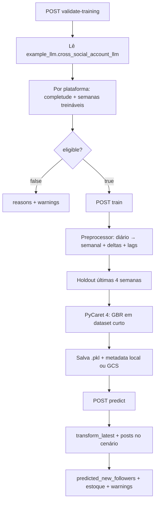

# Previsão social (seguidores) — notas internas completas

Documento de referência **local** (não precisa ir para o repositório).  
Resume o que foi feito no MVP de `/prediction/social/*`, por que cada decisão foi tomada e como o pipeline funciona ponta a ponta.

Pipeline oficial enxuto (pode subir no repo): [SOCIAL_PREDICTION_PIPELINE.md](./SOCIAL_PREDICTION_PIPELINE.md)  
Pipeline de ads (referência): [PREDICTION_PIPELINE.md](./PREDICTION_PIPELINE.md)

---

## 1. Objetivo de negócio

Prever **crescimento de seguidores** a partir da tabela agregada:

`example_llm.cross_social_account_llm`

Pergunta que o MVP responde na prática:

> Na próxima semana, quantos **novos seguidores** essa conta tende a ganhar?

Pergunta secundária (experimental no contrato):

> Se eu planejar N posts na semana, isso muda a previsão?

Com o sample atual a resposta honesta à segunda pergunta é: **quase não**. Por isso adotamos a **opção B** (manter `posts` no JSON, mas como experimental).

---

## 2. O que NÃO usar do repo antigo de “social”

No início pensamos nos agentes `instagram-insights`, `facebook-insights`, etc.  
**Não** é esse caminho.

- Agentes social leem tabelas **por conector**, nível post/mídia.
- Predição social usa **`cross_social_account_llm`** (série diária por conta/plataforma), análoga ao `cross_ads_llm` de ads.
- Não há dependência de `social_team`, prompts de insights, nem `cross_social_post_llm` no MVP (a tabela de posts existe no banco, mas não entra no modelo ainda).

---

## 3. Análise dos dados reais (CSV)

Arquivo usado:

`D:\Downloads\newSaas\cross_social_account_llm_202607241358.csv`

### 3.1 Shape geral

| Item | Valor |
|------|--------|
| Linhas | 203 |
| Contas | 1 (`account_id` `27573748882310275`, `biglinkai`) |
| Plataforma | só `Instagram` |
| Período | 2026-01-01 → 2026-07-22 |
| Semanas brutas | ~30 |
| Semanas após warmup (lag/rolling) | ~26 |

### 3.2 Colunas da tabela

```
date, platform, account_id, account_name,
current_followers, new_followers,
posts_count, posts_count_feed, posts_count_reels,
impressions, reach, reach_followers, reach_non_followers,
reach_feed, reach_reel, reach_ad, reach_story,
likes, comments, shares, saves, views, replies,
profile_visits, website_clicks, total_interactions
```

### 3.3 Achados que mudaram o desenho

| Achado | Decisão |
|--------|---------|
| `current_followers` constante (128 em todo o sample) | **Não** é target. Só `lag1` / base para `predicted_current_followers` |
| `new_followers` fluxo diário, ~82% zeros | Target = **`new_followers`** (soma semanal) |
| `posts_count*` só sobe ou fica igual (diff ≥ 0) | É **estoque cumulativo**, não posts do dia → feature = **delta** (`posts_published`) |
| `impressions` 100% nulo | Fora de critical e do modelo |
| `reach_*` detalhado 70–85% nulo | Só `reach` agregado nas features base |
| Correlação diária forte com `new_followers` | `shares`, `website_clicks`, `saves`, `comments`, `total_interactions`, etc. |
| Poucas semanas | Thresholds mais baixos que ads; holdout 4; GBR direto no treino |

### 3.4 Target: estoque vs fluxo

- **`new_followers`**: fluxo (ganho no período) → bom para regressão / forecast.
- **`current_followers`**: estoque → ruim como target (quase monótono / constante no sample).

Na resposta da API:

```text
predicted_current_followers ≈ current_followers_último + predicted_new_followers
```

---

## 4. Diferença estrutural vs ads (schema)

### Ads (já existente)

```text
user_uuid  →  schema org_{uuid_sem_hífen}_llm
              →  cross_ads_llm
request: spends { "meta-ads": 1500 }
```

O UUID **é** a chave do schema.

### Social MVP (o que implementamos)

```text
schema fixo: example_llm          (env CROSS_SOCIAL_SCHEMA, default example_llm)
tabela:      cross_social_account_llm
filtro:      account_id
user_uuid:   NÃO monta schema; só API + pasta do modelo (local/GCS)
```

Por isso o mesmo UUID do ads (`019ebc29…`) **pode** ser usado no social sem existir `org_019ebc29…_llm` com a tabela social.  
O que precisa ser igual entre **train** e **predict** é o mesmo `user_uuid` (para achar o `.pkl`).

Quando o ETL migrar social para schema por tenant, basta mudar `CROSS_SOCIAL_SCHEMA` ou voltar à regra `org_*`.

---

## 5. Arquitetura do código

### 5.1 Arquivos

| Arquivo | Papel |
|---------|--------|
| `utils/social_prediction_constants.py` | Tabela, schema, mapas de plataforma, thresholds, targets |
| `utils/social_prediction.py` | Fetch, preprocessor, inferência, load modelo |
| `utils/social_training_validation.py` | Elegibilidade (`/validate-training`) |
| `utils/social_training.py` | Treino PyCaret (`/train`) |
| `models/social_prediction.py` | Contratos Pydantic |
| `routes/social_prediction.py` | Rotas FastAPI |
| `main.py` | Registra `social_prediction_router` |
| `tests/test_social_prediction_preprocessing.py` | Testes com CSV + sintético |
| `docs/SOCIAL_PREDICTION_PIPELINE.md` | Doc curta (repo) |
| `utils/prediction_models/social/...` | Artefatos locais (não commitar) |

Namespace separado de `/prediction` (ads) de propósito: contrato e dados diferentes.

### 5.2 Endpoints

| Método | Path |
|--------|------|
| POST | `/prediction/social/validate-training` |
| POST | `/prediction/social/train` |
| POST | `/prediction/social/predict` |

Auth: mesma `verify_os_security_key` dos outros routers.

---

## 6. Como funciona o pipeline



### 6.1 Pré-processamento

1. Carrega histórico diário da conta (plataformas pedidas / suportadas).
2. Converte estoques de posts em **fluxo**:
   - `posts_published` = diff(`posts_count`).clip(lower=0)
   - idem feed/reels
3. Agrega **semana** (`freq="W"`):
   - fluxos (`new_followers`, reach, likes, …, `posts_published`) → **sum**
   - estoques (`current_followers`, `posts_count*`) → **last**
4. Features de calendário + lags/rolling (janela 4).
5. Warmup: strict dá `dropna` nas features; permissive imputa.

### 6.2 Features do MVP

**Target:** `new_followers`

**Cenário (treino e predict):** `posts_published`

**Lags / rolling:** entre outros  
`new_followers`, `reach`, `total_interactions`, `posts_published`,  
lags de engajamento (`likes`, `comments`, `shares`, `saves`, `views`, `profile_visits`, `website_clicks`),  
`current_followers_lag1`

**Calendário:** `week_of_year`, `month`, `quarter`, `year`, `week_of_month`

**Fora do MVP:** `impressions`, breakdowns `reach_*` esparsos, análise LLM.

### 6.3 Validação

- Itera plataformas do mapa (`instagram`, `facebook`, `tiktok`, `linkedin`, `youtube`).
- Sem linhas → card inelegível + warning (esperado se só há Instagram).
- Global: ≥1 plataforma ok + linhas pós-holdout ≥ 12 + variância no target (strict).
- Permissive é mais frouxo (foi o mode usado no treino que passou).

Thresholds sociais (mais brandos que ads):

| Constante | Valor |
|-----------|------:|
| `MIN_TRAINABLE_WEEKS_PER_PLATFORM` | 8 |
| `MIN_TRAINABLE_ROWS_PER_PLATFORM` | 6 |
| `MIN_TRAINABLE_ROWS_TOTAL` | 12 |
| `HOLDOUT_WEEKS_PER_PLATFORM` | 4 |

### 6.4 Treino

- Revalida; se inelegível → HTTP 422 com payload da validação.
- Split cronológico: últimas `4 × n_plataformas_ativas` linhas = holdout.
- PyCaret **4.0a** (igual ads): `RegressionExperiment(...)` + `.fit()` — **não** usa `.setup()` (API antiga).
- Com &lt; 40 linhas de treino → **GBR direto** (`create_model`, sem `compare_models`), porque `CompareResult` quebrava o `predict_model`.
- Finalize em train+holdout; salva pipeline.
- Sanity:
  - previsão negativa → só warning (clip na inferência)
  - previsões idênticas / posts não alteram → **só warning no MVP** (não aborta)
- Persistência:
  - Preferência GCS: `{user_uuid}/social/{account_id}/new_followers_model.pkl` + `metadata.json`
  - Sem GCS: `utils/prediction_models/social/{account_id}/{uuid}_new_followers.pkl`

### 6.5 Predict

Request:

```json
{
  "user_uuid": "019ebc29c11d76db87585fef3ae0a4d2",
  "account_id": "27573748882310275",
  "posts": { "instagram": 3 }
}
```

Fluxo:

1. Resolve conta (`account_id` ou única conta do schema).
2. `transform_latest` monta features da **próxima** semana (lags do passado).
3. Injeta `posts_published` = valor do request.
4. Roda pipeline; clip ≥ 0.
5. Devolve ganho + estoque estimado + `warnings` (opção B).

`user_uuid` do predict **deve ser o mesmo do train**, senão o `.pkl` não é encontrado.

---

## 7. Opção B — `posts` experimental

### Problema observado em teste real

| posts no request | `predicted_new_followers` |
|-----------------:|--------------------------:|
| 0 | ~8,54 |
| 3 | ~8,56 |
| 5 / 20 | ~8,56 |

Quase flat → modelo é **forecast-dominated**.

### `relative_margin_70` absurdo (`3e9`)

Artefato: `residual / max(|pred_holdout|, 1e-9)` quando pred≈0 no holdout (série zero-inflated).  
Não significa margem de bilhões de seguidores. Front **não** deve exibir isso como % confiável.

### Decisão de produto (B)

| Mantém | Significado |
|--------|-------------|
| Campo `posts` no contrato | Espaço para what-if futuro / UI |
| Valor principal | `predicted_new_followers` como **forecast** |
| `warnings` na resposta | Deixa explícito que posts é experimental |

**Não** forçamos sensibilidade artificial a posts (opção D) sem evidência nos dados.

Caminhos futuros:

- Mais histórico/contas → reavaliar importância de `posts_published`.
- Se correlação estabilizar → what-if “forte” sem mudar o shape do JSON.
- Se nunca estabilizar → ir para forecast puro (opção A) e tornar `posts` opcional/ignorado.

---

## 8. Mapa de plataformas

| API key | Valor em `platform` no banco |
|---------|------------------------------|
| `instagram` | `Instagram` |
| `facebook` | `Facebook` |
| `tiktok` | `TikTok` |
| `linkedin` | `LinkedIn` |
| `youtube` | `YouTube` |

Só Instagram tinha dados no sample; as outras aparecem no validate como “Sem registros…” (warning, não bloqueia se Instagram ok).

---

## 9. Exemplos de request que funcionaram

### Validate / Train

```json
{
  "user_uuid": "019ebc29c11d76db87585fef3ae0a4d2",
  "account_id": "27573748882310275"
}
```

Validate típico: `eligible: true`, Instagram ok (203 dias), warnings nas outras plataformas.

Train típico: ~13s, GBR, modelo local (GCS não configurado).

### Predict

```json
{
  "user_uuid": "019ebc29c11d76db87585fef3ae0a4d2",
  "account_id": "27573748882310275",
  "posts": { "instagram": 3 }
}
```

Saída útil: ~8,5 novos seguidores; estoque ~136,5; datas da semana prevista.

---

## 10. Problemas técnicos que apareceram e correções

| Erro | Causa | Correção |
|------|-------|----------|
| `RegressionExperiment` sem `.setup` | Código escrito na API PyCaret 3; repo usa 4.0a | Construtor + `.fit()` como ads |
| `'CompareResult' has no attribute 'predict'` | `n_select=1` / objeto resultado passado ao `predict_model` | GBR via `create_model(...).pipeline`; compare só com `[0]` se usado |
| Schema `org_*` vazio | Dados só em `example_llm` | `CROSS_SOCIAL_SCHEMA=example_llm` no MVP |
| Sanity abortando | Posts não alteram pred / pred negativa | Warnings apenas no social MVP |

---

## 11. O que fica de fora (próximas iterações)

- Async / fila Redis (ads já tem padrão; social ainda sync).
- LLM analysis textual (ads tem `PredictionAgent`; social não).
- Usar `cross_social_post_llm` (conteúdo/tipo de post).
- Features `reach_*` quando completude melhorar.
- Schema por tenant (`org_{uuid}_llm`) quando ETL padronizar.
- Cap / reformulação de `relative_margin_70` para zero-inflated.
- Multi-conta / multi-plataforma de verdade no mesmo modelo pooled.

---

## 12. Como explicar em uma frase

> Montamos um pipeline espelhado no ads (validate → train → predict), lendo `example_llm.cross_social_account_llm`, prevendo `new_followers` semanal com GBR; `posts` fica no contrato como cenário experimental, mas com o dado atual o sistema se comporta essencialmente como forecast da próxima semana.

---

## 13. Checklist rápido para rodar de novo

1. API com `social_prediction_router` registrado.
2. Postgres com `example_llm.cross_social_account_llm` acessível (`.env`).
3. `POST /prediction/social/validate-training` → `eligible: true`.
4. `POST /prediction/social/train` (mesmo `user_uuid` + `account_id`).
5. `POST /prediction/social/predict` com o **mesmo** `user_uuid` e `posts`.
6. Não commitar `utils/prediction_models/`.
